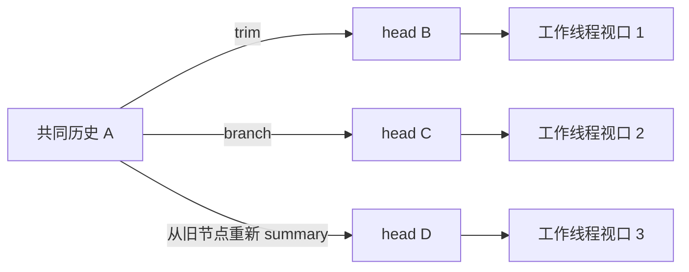
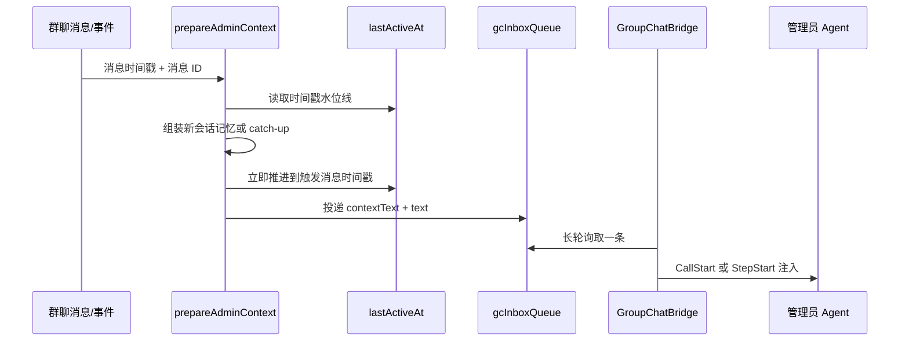

# 群聊管理员线程态势、上下文水位线与分叉语义审计

> 状态：调查与设计建议，不包含代码改动  
> 日期：2026-07-12  
> 关联文档：
> - [group-chat-admin-context-injection-design.md](./group-chat-admin-context-injection-design.md)
> - [group-chat-session-lineage-design.md](./group-chat-session-lineage-design.md)
> - [group-chat-session-pool-data-link.md](./group-chat-session-pool-data-link.md)
> - [group-chat-command-center-design.md](./group-chat-command-center-design.md)

## 1. 本次审计要回答的问题

本次调查不再只问“管理员有没有看到群聊消息”，而是回答以下五个问题：

1. 管理员管理的核心对象究竟是会话，还是工作线程？
2. 管理员每次被唤醒时，是否能准确知道当前有哪些线程、每条线程的 head、运行状态和 Task 完成情况？
3. `lastActiveAt` 水位线在并发通知、管理员忙碌和管理员会话轮转时，是否可能重复或遗漏信息？
4. 一个旧会话、已归档会话或非当前 head 再次执行 trim、summary、branch 时，产品语义应该是什么？
5. 群消息、生命周期事件、血缘边、管理员历史会话和注入上下文是否存在明确的总量边界？

审计范围包括：

- `server/routes/group-chat.js`
- `server/routes/session.js`
- `local-features/group-admin/src/bridge.ts`
- `local-features/group-admin/src/index.ts`
- `prebuilt-agents/official/work-group/.agentdev/prompts/system.md`
- 群聊设置与工作线程面板的相关前端模块

## 2. 结论摘要

当前系统已经具备了线程级管理所需的大部分原始数据：会话血缘、线程投影、Task、运行状态、上下文用量和最近消息都已存在。但管理员的认知入口仍然是“群聊消息 + 扁平会话工具”，因此形成了明显的不对称：

> 人类用户已经在工作面板中按线程管理，而管理员仍主要按会话和消息管理。

这不是提示词措辞的小问题，而是管理员上下文包的主索引仍然选错了。管理员当前先看到“发生了哪些消息”，需要时再自己拼出“这属于哪条线程”；正确顺序应当是先得到稳定的线程态势快照，再用消息增量解释“为什么状态发生变化”。

当前最重要的风险有六项：

| 优先级 | 问题 | 直接后果 |
|---|---|---|
| P0 | 管理员系统提示和常用工具仍以会话为核心 | 多 head 时容易派错、重复建会话或遗漏线程 |
| P0 | 新管理员会话不重建线程态势，只重放普通群消息 | 轮转后丢失历史生命周期、Task 与当前 head 认知 |
| P0 | 水位线使用时间戳，并在真正消费前推进 | 并发时可能重复、遗漏、倒退或“已读但未处理” |
| P0 | bridge 的轮询在空闲派发后等待整轮完成 | 静态分析显示 busy 注入链路可能无法按设计持续收取新消息 |
| P1 | 旧 head 产生新后继时会直接覆盖身份的全局当前会话 | 一条历史支线可能意外劫持默认派发目标 |
| P1 | 消息、血缘、管理员历史和 inbox 缺少统一总量策略 | 长期运行后上下文、存储、启动和查询成本持续增长 |

建议把管理员认知体系升级为：

```text
线程态势快照（现在是什么状态）
        +
结构化增量事件（刚刚发生了什么变化）
        +
触发请求（现在需要管理员做什么）
        +
按需查询工具（需要证据时深入查看）
```

其中，群聊消息仍是事实记录，但不再承担管理员状态索引的职责。

## 3. 需要统一的产品对象

### 3.1 四个不同对象不能继续混用

| 对象 | 定义 | 用户心智 |
|---|---|---|
| 会话 Session | 一段具体模型上下文及其运行时快照 | 可打开、可查看、可 trim/summary/branch |
| 血缘节点 Lineage Node | 血缘图中的一个 session 节点 | 用于解释上下文怎样延续 |
| 工作线程 Work Thread | 从某个工作起点延伸到一个叶子 head 的工作视口 | 用户真正要持续关注和派发的对象 |
| 身份默认焦点 Identity Focus | 某个 Agent 身份在未指定线程时的默认派发目标 | 只是路由便利指针，不等于“唯一活跃线程” |

当前 `chat.sessions[identityRef]` 同时承担了“persistent 会话映射”“最新 head”“默认派发目标”三种语义。在只有一条线时没有问题；一旦出现 branch 或旧节点再生后继，这三个概念就不再相等。

### 3.2 管理员真正要管理的是 head 集合

对于一棵有很多历史交叉的会话树，管理员无需在每次决策时理解完整树结构。管理员日常需要的是：

- 当前有多少个叶子 head；
- 每个 head 代表哪项工作；
- 哪些正在运行，哪些可以继续，哪些已经完成，哪些只是历史；
- 每个 head 最近发生了什么；
- 指令应该派到哪个 head。

因此，完整血缘树是“可追溯证据”，head 列表才是“日常管理视口”。较早节点是否共享、在哪个点交叉，不应占据管理员的主认知带宽。



用户看到和管理员管理的是三个工作线程视口；共同历史 A 只在“查看脉络”时展开。

## 4. 当前管理员上下文链路

### 4.1 当前数据流



当前上下文由三类内容组成：

1. 新管理员 session 首次注入：群聊基本信息、`GROUP.md`、指定时间范围内的普通群聊消息；
2. 后续唤醒：`lastActiveAt` 之后的 catch-up；
3. 当前触发：一句 user 事件描述，或直接 @管理员时的用户原文。

这个结构解决了“原始 Agent 回复不应伪装成 user 消息”的角色问题，但没有解决“管理员如何恢复线程态势”的问题。

### 4.2 当前有哪些可用事实

系统实际已经可以提供：

- `groupByLineage()`：所有根到叶路径、head、lifecycle、是否可派发；
- `/gc/session_tasks`：Task 状态、上下文用量、最新一条对话；
- awareness：运行中、排队、空闲、离线、模型和上下文水位；
- 生命周期事件：trim、summary、branch、archive、interrupt、offline；
- 群消息 routing：目标身份、目标 session、运行结果。

问题不在数据缺失，而在这些数据没有被编译成管理员每次决策前都能依赖的“线程态势包”。

## 5. 管理员心智仍停留在会话级

### 5.1 系统提示明确说“你管理的对象是会话”

管理员系统提示当前使用以下规则：

- 默认复用某 Agent 最近会话；
- 不确定时先调用 `gc_sessions`；
- 通过 `targetSessionId` 精准路由；
- 新话题用 `forceNew`。

这些规则在单线 persistent 会话模型下成立，但在多个工作线程同时存在后会产生三个问题：

1. “最近会话”不一定是语义相关线程；
2. `gc_sessions` 返回的是扁平会话列表，管理员需要自行恢复血缘关系；
3. `forceNew` 创建的是无血缘新会话，而用户真实意图可能是从某条线程的 head 继续。

### 5.2 工具虽然有线程能力，但主路径没有使用

`gc_session_threads` 已注册，却存在以下不足：

- 不是管理员唤醒时的默认态势输入；
- 描述仍强调“探索/编码阶段”，没有采用当前 UI 的“进行中/已完成”管理心智；
- 格式化文本只输出 head、深度和链路，不输出运行状态、Task 进度、上下文用量、最近消息和可派发性；
- `gc_overview` 和 `gc_status` 仍按身份下的扁平 session 展示；
- `gc_session_tasks` API 虽返回 `contextUsage` 与 `latestMessage`，管理员工具的文本没有展示；没有 Task 时还会提前返回，连这两项也一起隐藏；
- `gc_session_summary` 名称像“工作摘要”，实际只返回标题、时间、目录和类型等元数据。

因此管理员即使主动调用工具，也需要多次查询并自行拼装，且容易误解 `session_summary` 的信息密度。

### 5.3 建议的管理员核心心智

管理员应被明确告知：

> 你管理的是工作线程的 head，而不是会话列表。会话是线程的历史载体；血缘用于追溯；Task、运行状态和最近消息共同决定线程现在是否需要行动。

建议默认分类只有两大组：

- **进行中**：包含运行中、排队、空闲可继续、尚未建立 Task 的新工作；
- **已完成**：已有 Task 且全部完成，等待用户决定是否继续、验收或保留为历史。

“运行中/排队/空闲/离线”是执行状态，“进行中/已完成”是工作状态，两者不可混为一类。

管理员的决策矩阵应是：

| 工作状态 | 执行状态 | 默认判断 |
|---|---|---|
| 进行中 | running/queued | 不重复派发；可按需中断 |
| 进行中 | idle/offline | 可以向该 head 派发增量指令 |
| 进行中且无 Task | idle/offline | 视为刚开始或未结构化，不得误判完成 |
| 已完成 | 任意 | 默认不追加；等待验收、新需求或明确续作 |
| 历史/不可用 | offline | 只读追溯；如需复活，应生成新的 head |

## 6. 水位线机制的正确性问题

### 6.1 时间戳不是可靠游标

当前水位线是：

```text
chat.lastActiveAt['work-group:admin'] = message.timestamp
```

并通过 `message.timestamp > lastActiveAt` 选择未读消息。时间戳无法提供严格全序：同一毫秒可能写入多条消息，异步回调也可能以不同顺序执行。

具体风险：

- 两条消息时间戳相同，第一条推进水位线后，第二条可能被 `<= lastActive` 排除；
- `includeCurrentMessage=true` 时，筛选在检查当前触发上界前直接返回 true，可能把已经存在的“未来消息”提前带入；水位线却只推进到当前触发时间，未来消息之后会再次注入；
- 多个通知并发调用 `prepareAdminContext()` 时，可能读取同一个旧水位线，各自注入重叠消息；
- 并发调用最后执行的是整份 `writeGroupChat(chat)`，较早快照可能覆盖较晚写入，水位线甚至可能倒退，并有覆盖其他群聊字段的风险。

### 6.2 水位线推进得太早

`prepareAdminContext()` 在以下动作之前就写入新水位线：

- inbox 是否成功入队；
- bridge 是否成功取得消息；
- 管理员 call 是否启动；
- 上下文是否真正注入；
- 管理员是否完成本轮处理。

因此它更准确的名字是“已准备游标”，不是“已消费游标”。若进程在推进后、入队或消费前失败，消息会被标记为已读但管理员从未看到。

### 6.3 新会话基线与 catch-up 会重复

管理员滚动到新 session 时：

- 群记忆会按 `adminMemory.range` 重放近期普通消息；
- 如果旧水位线非零，又会追加该水位线之后的 catch-up；
- 同一条普通消息可能同时出现在群记忆和 catch-up 中。

相反，群记忆主动过滤了所有 `kind='event'` 消息，所以更严重的问题是：

- 较早的 trim、summary、branch、Task 完成、归档等事件不会进入新管理员 session 的基线；
- 管理员只保留旧水位线之后的事件；
- 管理员轮转后无法仅靠注入内容恢复“现在有哪些线程、head 在哪里、哪些已完成”。

这说明管理员 session 轮转当前只是“重放近期聊天”，不是“重建管理状态”。

### 6.4 busy 路径需要专项验证

设计文档认为管理员 call 运行期间，bridge 会继续轮询 inbox，并在 `@StepStart` 注入新水位线。但当前 `runLoop()` 在空闲消息到达后会：

```text
await handleMessage()
  -> await dispatchViaArbiter()
     -> await waitForCompletion()
```

也就是说，同一个轮询循环会等待整轮 call 完成，期间不能继续发起下一次 inbox 轮询。基于静态代码分析，常规情况下新消息只能留在服务端队列，等本轮完成后才被取出，`pendingBuffer` 的 busy 注入路径可能无法按原设计工作。

这需要通过带时间标记的集成测试确认，但在确认前不能把“运行中实时水位线注入”视为可靠能力。

### 6.5 建议：序号游标 + 投递确认

每个群聊应在写入消息时分配单调递增的 `seq`：

```json
{
  "id": "msg-...",
  "seq": 1842,
  "timestamp": 1783...
}
```

管理员至少维护两个游标：

```json
{
  "adminDelivery": {
    "enqueuedSeq": 1842,
    "acknowledgedSeq": 1839
  }
}
```

- `enqueuedSeq`：已生成并可靠写入待投递队列；
- `acknowledgedSeq`：bridge 已确认注入或本轮已处理；
- 重启后从 `acknowledgedSeq + 1` 重放；
- 同一批次携带稳定 `deliveryId`，bridge 持久去重；
- 游标更新与消息/事件追加使用同一原子更新或串行化事务。

如果短期不引入持久队列，最低限度也应将 `(timestamp, messageId)` 改为 `(seq)`，并把水位线推进移动到 inbox 成功接收确认之后。

## 7. 管理员会话轮转应如何重建认知

### 7.1 当前“记忆范围”和“上下文限制”是两件不同的事

- `adminMemory.range` 决定新会话重放多少天普通消息；
- `tokenLimit` / `ratioLimit` 决定旧管理员 session 何时滚动；
- 它们没有共同的总 token 编译预算。

设置为“全部记录”时，群记忆会遍历全部普通消息；单条虽截断到约 800 字符，但总条数没有上限。因此“每条受限”不等于“总量受限”。

另外，前后端默认值不一致：

| 位置 | token 默认值 | ratio 默认值 |
|---|---:|---:|
| 服务端 `group-chat.js` | 200000 | 20% |
| 前端设置模块 | 100000 | 80% |

新建群由服务端写入显式值时通常能遮住差异，但旧数据、缺字段数据或局部迁移时会呈现不同含义，必须统一。

### 7.2 建议的 Context Package v2

管理员每次启动新 session 时，不应把群聊历史当作主状态，而应编译一个带版本的上下文包：

```text
1. 身份与静态背景
   - 群聊名称、目标、成员、工作目录、GROUP.md

2. 线程态势快照（权威当前态）
   - 每个身份的 head 列表
   - 工作状态、执行状态、Task x/y
   - 上下文用量、最近消息、最后更新时间
   - 默认焦点是哪条线程及原因

3. 最近增量事件
   - 从 snapshotSeq 之后的生命周期与路由事件
   - 每条事件明确 threadRef、headSessionId、sourceSessionId

4. 近期叙事窗口
   - 在剩余 token 预算内选择普通群消息
   - 使用 messageId/seq，避免与增量区重复

5. 当前触发请求
   - 用户原文或一句结构化事件意图
```

态势快照回答“现在是什么”，增量事件回答“怎么变成这样”，群消息回答“为什么要做这件事”。三者不能互相替代。

### 7.3 滚动触发本身也要可解释

管理员自动滚动目前只停止旧 runtime、创建新 session、在下次消息时初始化上下文。建议补充：

- 记录 `admin_session_rolled` 内部事件；
- 记录旧 session、阈值模式、触发用量、新 session；
- 新 session 的快照携带 `compiledAtSeq`；
- 旧 session 仅供审计，不参与成员工作线程；
- 如果滚动后长期没有新消息，明确新 runtime 是否需要立即初始化，避免“已启动但尚无管理认知”的中间态。

## 8. 分叉、旧 head 和已归档会话的语义

### 8.1 当前实现会发生什么

血缘投影会遍历所有根到叶路径，因此一个源节点产生多个子节点时，UI 最终能得到多个工作线程视口，这是合理方向。但血缘写入时无条件执行：

```text
chat.sessions[identityRef] = toSessionId
```

这意味着：

- 当前 head trim/summary：新会话成为默认焦点，符合预期；
- 当前 head branch：新分支成为默认焦点，是否符合用户意图并不总是明确；
- 旧 head 或中间节点再次 summary/trim：新后继会覆盖全局默认焦点；
- 已归档会话仍保留文件时可以被 branch；新会话通常是未归档可运行会话，并覆盖默认焦点；
- “最后发生的一次血缘操作”事实上决定了默认派发目标，而不是“用户正在管理的线程”。

因此当前数据展示是多线程的，默认路由仍是单指针且采用最后写入获胜。

### 8.2 建议的分叉判定规则

核心原则：**线程连续性由源节点当时是否为该线程 head 决定，而不能只看操作名。**

| 操作 | 源节点条件 | 结果 |
|---|---|---|
| trim/summary/compact | 源节点是该线程当前 head | 同一线程迁移 head 到新 session |
| trim/summary/compact | 源节点不是当前 head | 从历史节点复活出一条新线程 |
| branch | 任意节点 | 总是创建新线程 |
| 从已归档节点派生 | 任意操作 | 源节点保持归档；新 session 成为新线程 head |
| 纯归档 head | 无后继 | 线程进入历史/不可派发 |

也就是说，“summary/trim 等于同一线程”只在它发生于当前 head 时成立。从旧节点再次 summary，本质上已经产生了并行未来，应该被视为新线程，而不是偷偷改写原线程。

### 8.3 默认焦点不应自动等于最新血缘目标

建议把当前单一映射拆成两个概念：

```json
{
  "identityFocus": {
    "programming-helper:main": "thread-ref-2"
  },
  "threadHeads": {
    "thread-ref-1": "session-B",
    "thread-ref-2": "session-C"
  }
}
```

短期可以继续从血缘投影线程，但至少要有稳定 `threadRef` 或等价的可寻址键。默认焦点的更新规则应是：

- 从当前默认 head 做 trim/summary：焦点随 successor 前移；
- 创建 branch：新线程出现，但只有用户明确“切到分支”时才改变焦点；
- 从旧节点复活：不自动抢占焦点；
- 管理员派发必须优先使用明确 `threadRef/headSessionId`；只有单线程或用户没有歧义时才允许默认路由。

### 8.4 管理员看到的事件必须指向线程

生命周期事件不能只说“编程小助手会话已精简”。至少需要：

```text
编程小助手 · 线程「部署位置预览」
精简历史：#source123 → #head456
新 head 已接管；原会话仍可查看
```

如果是旧节点复活：

```text
编程小助手 · 由历史会话「部署位置预览 #source123」派生新线程
新 head：#head789
原线程当前 head 未改变
```

这样管理员才能区分“同一线程正常前移”和“增加了一个需要管理的新 head”。

## 9. Task 事件重复与完成判断

### 9.1 当前 Task 完成检测可能重复

`trackGroupChatDispatch()` 每次派发都会新建一个空的 `knownCompletedTaskIds`。轮询 Todo 时，所有已经是 `completed` 的 Task 都会被当成“本次新完成”。因此：

- 同一 session 再次派发时，旧 completed Task 可能重新生成事件；
- 同一 session 存在多个跟踪循环时，彼此没有共享去重状态；
- 进程重启后内存去重全部丢失；
- 事件没有稳定的幂等键，例如 `sessionId + taskId + completionRevision`。

这会污染群消息、水位线和管理员的完成判断。

### 9.2 建议的 Task 事件模型

事件必须带稳定键：

```text
task_event:{sessionId}:{taskId}:{statusVersion}
```

并在群聊持久层做唯一性检查。跟踪启动时先读取当前 Task 快照作为 baseline，只对 baseline 之后的状态跃迁发事件。

Task 完成与线程完成也要分开：

- 单个 Task 完成：线程进度发生变化；
- 全部 Task 完成：线程可归类为“已完成”；
- 没有 Task：表示未结构化或刚开始，不能判定完成；
- 全部完成后又新增 pending Task：线程回到“进行中”；
- Agent 一次回复说“完成”但 Task 未同步：属于证据冲突，应展示而不是静默覆盖。

## 10. 总量、预算与长期运行问题

### 10.1 当前缺少明确上限的集合

| 集合 | 当前行为 | 风险 |
|---|---|---|
| `chat.messages` | 持续 append | 群文件、读取、写回和上下文编译持续变大 |
| `chat.sessionLineage` | 持续 append | 线程投影遍历成本持续增加 |
| `adminSessionHistory` | 只去重、不裁剪 | 管理员 popover 和会话池不断增长 |
| `gcInboxQueue` | 内存数组、无长度上限 | 消费慢时积压；服务重启全部丢失 |
| 群记忆“全部记录” | 单条截断、总条数不限 | 新管理员会话可能一次注入巨大上下文 |
| Task 事件 | 缺少持久幂等 | 重复事件放大以上所有集合 |

### 10.2 需要区分四种不同的“上限”

不能用一个 token 数解决所有问题：

1. **存储保留策略**：原始群消息是否永久保留，何时分段归档；
2. **索引工作集**：线程投影和最近活动查询加载多少活跃数据；
3. **管理员编译预算**：一次上下文包最多允许多少 token；
4. **实时队列背压**：管理员忙时允许积压多少未处理通知。

建议初始策略：

- 原始消息保持可追溯，但按月或按固定条数分段，不再把整个数组反复写入单一 JSON；
- 活跃线程完整加载，历史线程只加载摘要索引；
- 管理员上下文包设硬 token 预算，并按“态势快照 > 当前触发 > 增量事件 > 近期消息”的优先级裁剪；
- 生命周期事件不按文本截断，而按结构化字段保留；
- inbox 使用持久投递日志或至少设置上限、合并同类状态事件并暴露积压告警；
- 管理员历史 session 默认只在 UI 展示最近若干条，其余按需加载，但存储层不必立即删除。

### 10.3 推荐的上下文预算分配

可先采用比例而不是固定数字：

| 内容 | 预算建议 | 不足时策略 |
|---|---:|---|
| 静态规则与 GROUP.md | 15% | 对 GROUP.md 分节摘要，不丢硬约束 |
| 线程态势快照 | 30% | 活跃 head 全保留，历史只保留统计 |
| 未确认增量事件 | 20% | 同线程连续事件合并，但保留首尾 seq |
| 当前触发与附件摘要 | 20% | 当前用户原文优先，不截关键参数 |
| 近期群聊叙事 | 15% | 从近到远裁剪，可用工具读取全文 |

该预算独立于管理员 session 的滚动阈值。滚动阈值决定“何时换容器”，编译预算决定“新容器里装什么”。

## 11. 建议的管理员线程态势包

管理员每次因需要判断或派发而激活时，至少应看到如下结构：

```text
─── 当前线程态势 · snapshotSeq 1842 ───
编程小助手（2 进行中 / 3 已完成 / 2 历史）

[进行中] 部署位置预览与国王塔激活功能
threadRef: programming-helper:main/thread-02
head: session-...-a91f
执行: 空闲，可继续
Task: 1/4 完成
上下文: 10%，压缩阈值 80%
最近消息: 现在做部署系统的设计局限性调查……

[已完成] D6 核心战斗闭环
threadRef: programming-helper:main/thread-01
head: session-...-c02e
执行: 空闲
Task: 6/6 完成
最近消息: 气球兵死亡逻辑已经完成……

默认焦点: thread-02
原因: 用户最近一次明确选择
```

管理员不需要默认看到完整血缘。只有出现以下情况才主动查看脉络：

- 用户提到旧工作或“从之前版本继续”；
- 同名线程有多个 head；
- 默认焦点不明确；
- 发生旧节点复活、归档节点派生或血缘缺失；
- 需要解释上下文从哪里继承。

## 12. 工具与提示词的改造建议

### 12.1 系统提示词

需要完成以下语义迁移：

- “你管理的对象是会话”改为“你管理的是工作线程的 head”；
- 会话 ID 是路由参数，不是主要认知对象；
- 派发前先看线程态势，禁止仅凭“最近会话”猜测；
- running/queued 不重复派发；idle 且进行中才允许增量派发；
- 已完成默认不续作；无 Task 不等于完成；
- 遇到多个语义相近 head 时询问用户或明确列出选择；
- 生命周期事件只代表结构变化，不自动代表工作完成。

### 12.2 工具边界

建议收敛为三层：

1. `gc_thread_overview`：一次返回管理员可决策的全部 head 摘要；
2. `gc_thread_detail(threadRef)`：Task、最近消息、上下文、运行状态、完整脉络；
3. `gc_dispatch(threadRef, text)` / `gc_interrupt(threadRef)`：线程级操作，服务端解析为当前 head。

现有 session 级工具可以保留为底层诊断能力，但不应继续作为管理员主操作面。

### 12.3 工具输出必须与人类面板同源

人类工作面板和管理员工具应消费同一个线程聚合 DTO，至少包含：

```text
threadRef, identityRef, title,
headSessionId, lifecycle, canDispatch,
workStatus, runtimeStatus,
taskSummary, contextUsage, latestMessage,
updatedAt, lineageSummary
```

否则会继续出现“人看到已完成，管理员只看到编码阶段”或“人看到空闲，管理员只知道最近会话”的分裂。

## 13. 建议实施顺序

### Phase A：先让单个管理员 session 内的心智跑通

目标是不依赖轮转，也能稳定按线程判断和派发。

1. 管理员提示词改为线程级；
2. 提供与工作面板同源的线程 overview/detail；
3. 派发和中断支持 `threadRef`，内部解析 head；
4. 生命周期事件明确线程、source 和 new head；
5. Task 事件增加持久幂等键。

### Phase B：修正水位线与实时投递

1. 群消息增加单调 `seq`；
2. 上下文准备与游标更新串行化；
3. 区分 enqueued / acknowledged；
4. 验证并修正 bridge 在 call 期间的持续轮询；
5. 增加崩溃恢复、同毫秒并发和重复投递测试。

### Phase C：管理员轮转重建

1. 新 session 注入线程态势快照；
2. 普通消息窗口与事件增量按 seq 去重；
3. 记录 `snapshotSeq` 和滚动原因；
4. 统一前后端阈值默认值；
5. 明确滚动后无新消息时的初始化语义。

### Phase D：总量与长期存储

1. 群消息分段或事件日志化；
2. 活跃索引与历史存储分离；
3. inbox 背压和持久化；
4. 管理员上下文编译硬预算；
5. 历史 session、血缘和事件的归档策略。

这个顺序符合当前优先级：先在“不轮转”的一个管理员会话里跑通线程管理，再解决轮转和长期规模问题。但 Phase A 不能继续建立在会话级默认路由上，否则越完善 UI，管理员与人类的认知差距越大。

## 14. 验收场景

### 14.1 两条并行线程

- 同一身份有两个 idle head；
- 用户说“继续部署预览”；
- 管理员必须命中对应 thread，而不是最后更新的 session。

### 14.2 运行中收到新消息

- 管理员 call 运行 30 秒；
- 期间连续写入用户消息、Task 完成、session trim；
- 本轮或下一轮必须按 seq 无遗漏、无重复地看到；
- 不得提前推进 acknowledged cursor。

### 14.3 管理员自动轮转

- 旧 session 达到阈值；
- 新 session 首次激活即能列出所有当前 head、Task、运行状态与默认焦点；
- 近期普通消息和 catch-up 不重复；
- 较早的生命周期事件不需要全文重放，但其结果必须体现在态势快照中。

### 14.4 旧 head 再 summary

- 线程 T 的当前 head 为 B；
- 用户从历史节点 A 再 summary 得到 C；
- 系统生成新线程 T2，T 的 head 仍为 B；
- 默认焦点不被 C 自动抢占；
- 事件明确说明“由历史节点派生新线程”。

### 14.5 已归档会话再 branch

- A 已归档但文件仍存在；
- 从 A branch 得到 D；
- A 保持归档只读，D 是可派发的新线程 head；
- 不得将 A 重新标记为可派发；
- 用户和管理员看到相同的线程数量与状态。

### 14.6 Task 重开不重复

- session 已有 3 个 completed Task；
- 再次派发一个增量任务；
- 不得重新生成前三个 `task_completed` 事件；
- 新 Task 完成只生成一次事件，即使存在多个跟踪器或服务重启。

### 14.7 大群长期运行

- 10,000 条普通消息、2,000 条事件、100 条血缘边、30 个管理员历史 session；
- 新管理员上下文包不超过预算；
- 活跃线程查询不需要加载所有消息全文；
- 历史仍可按需追溯；
- inbox 积压可观察且不会无限增长。

## 15. 最终设计判断

工作线程设计最有价值的地方，不是把会话树画得更漂亮，而是把复杂的树压缩成一组可管理的 head。完整树可以无限分叉，用户和管理员的主界面仍然只需回答：

> 现在有哪些工作在推进？每项工作的最新 head 是谁？它正在运行、可以继续，还是已经完成？

管理员上下文也必须遵循同一个原则。消息水位线只能保证“新信息被送达”，不能替代线程态势；群聊历史只能解释背景，不能替代当前状态；`chat.sessions[identityRef]` 只能做默认焦点，不能替代多线程 head 集合。

下一阶段的核心不是继续增加更多事件文字，而是建立一个稳定、同源、可重建的线程态势快照，并用可靠的序号水位线把变化增量送到管理员。只有这样，人类工作面板与管理员才真正共享同一套管理心智。
