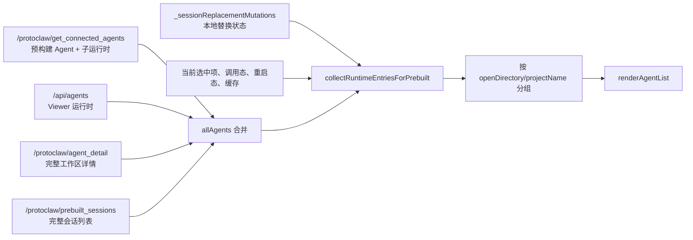
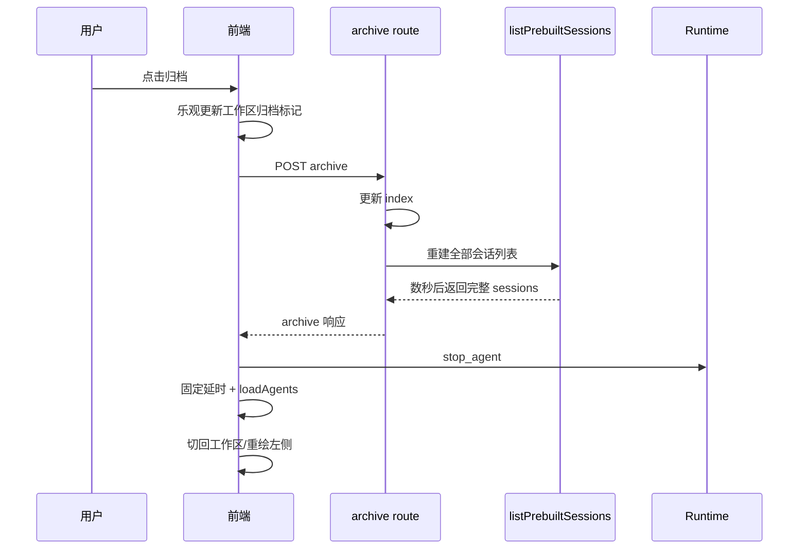
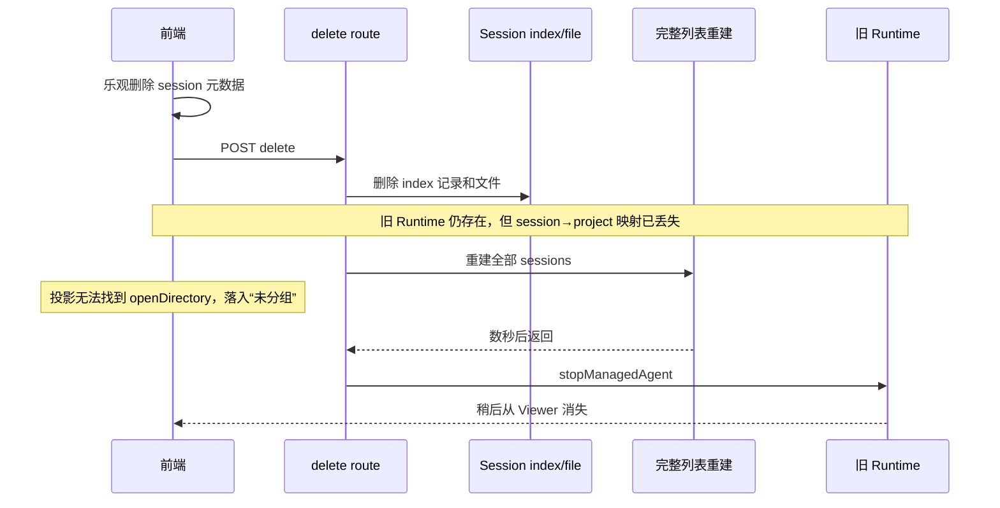

# 左侧会话列表状态、时序与性能审计

> 审计日期：2026-07-19  
> 审计对象：AgentDevClaw 左侧运行时/会话列表，以及创建、打开、归档、删除、摘要、精简、分支替换等相关流程  
> 审计性质：正文保留原始只读代码审计、历史变更审计和本地运行态采样；第 21 节追加第一至第三实施阶段的落地记录  
> 版本管理：位于 `docs/`，遵循仓库现有 `.gitignore`，不纳入版本管理  
> 当前结论状态：共同根因已定位；本轮约定的第一至第三阶段已实现并通过核心回归，独立轻量 sidebar read model 与事件化仍属于后续工作

## 1. 执行摘要

本次审计确认，用户感知到的以下问题不是互不相关的前端小毛病：

- 归档会话后，左侧运行时迟迟不消失；
- 新建会话后，工作区内已经存在，左侧列表仍很久不显示；
- 摘要、精简或分支替换已经生成目标会话，仍需等待后才切换；
- “正在生成摘要/正在精简”等临时提示，在目标会话已经切换后仍继续残留；
- 删除会话时，旧运行时短暂落入“未分组”，随后才消失；
- 左侧列表的更新速度、顺序和最终状态缺少一致性。

这些现象共享同一组底层原因：

1. **左侧列表不是一份权威状态，而是多份异步数据的即时投影。** 当前实现把连接运行时、会话索引、agent 详情、本地临时 mutation、当前导航状态和缓存合并后再渲染。任意来源延迟、提前删除或返回旧快照，都会产生可见的中间态。
2. **会话变更接口把完整会话列表重建放进同步响应关键路径。** 在当前 1000 级会话数据下，一次完整列表请求实测需要数秒；归档、删除和替换流程因此被不必要地串行阻塞。
3. **前端用全局重量级快照确认单个运行时的就绪和消失。** 新建路径至少需要两次全局连接快照和固定等待；替换后的清理最多反复执行十次重型刷新。
4. **临时状态缺少完整身份和生命周期。** “正在生成”占位项没有目标会话/目标运行时身份，删除又提前丢失旧会话的项目分组元数据，因此 UI 无法稳定地把中间状态绑定到正确位置。
5. **轮询目标周期小于请求耗时。** 1 秒和 3 秒级轮询驱动的是 0.4～10 秒级请求，导致系统接近持续扫描，既增加延迟，也放大快照竞态。

因此，本问题不应继续以“再调一个定时器”“先隐藏一条 DOM”“多刷新一次列表”的方式修复。正确方向是：

1. 先建立可观测的操作时序和确定性回归测试；
2. 再为左侧列表建立统一、带身份的操作状态；
3. 把完整会话列表移出创建、归档、删除、替换的响应关键路径；
4. 将左侧列表改为独立的、带 revision 的轻量读模型；
5. 最后引入事件驱动，并保留快照恢复能力。

## 2. 审计范围与非目标

### 2.1 范围

本次覆盖：

- 左侧预构建 Agent、子运行时和外部运行时的组合与分组；
- `programming-helper` 工作区会话与运行时的关联；
- 会话创建、打开、归档、删除、摘要、精简、分支替换；
- 前端轮询、全局 single-flight、列表渲染签名和本地 mutation；
- 服务端会话索引、handoff summary、session 文件统计与完整列表生成；
- 运行时启动、ready 确认、停止信号与 Viewer 断开之间的生命周期边界；
- 相关历史修复和现有测试覆盖。

### 2.2 非目标

本次没有：

- 修改任何功能代码；
- 对会话正文内容做业务审查；
- 断言网络、磁盘或浏览器是唯一原因；
- 直接决定最终 API 命名和数据库/文件格式；
- 建议立即移除所有轮询；
- 建议把所有列表一次性迁移到全新框架。

## 3. 证据等级与结论纪律

本文使用以下标记：

| 标记 | 含义 |
|---|---|
| **已确认事实** | 可直接由代码、运行采样、数据规模或提交历史证明 |
| **确定性因果** | 给定当前代码顺序，所述中间态必然存在；是否肉眼可见取决于耗时 |
| **高可信推断** | 由多份证据共同支持，但仍应通过后续埋点量化占比 |
| **设计建议** | 尚未实现的整改方向，不作为当前事实 |

本文不把设计建议包装成已经证明的修复。每项建议都包含负面风险、缓解方式和回滚条件。

## 4. 当前系统的真实数据流

左侧列表不是直接渲染某一个服务端列表。当前数据路径如下：



关键实现位置：

- 全局加载和合并：[`public/src/app-main.js`](../../public/src/app-main.js#L380)
- 左侧运行时投影：[`public/src/modules/runtime-status.js`](../../public/src/modules/runtime-status.js#L144)
- 左侧项目分组和“未分组”回退：[`public/src/app-main.js`](../../public/src/app-main.js#L158)
- 本地替换 mutation：[`public/src/modules/session-mutation.js`](../../public/src/modules/session-mutation.js#L1)
- 全局共享状态：[`public/src/app-core.js`](../../public/src/app-core.js#L397)

### 4.1 当前模型的核心不变量没有被显式表达

左侧列表实际依赖以下不变量，但代码没有统一维护它们：

1. 每个可见子运行时必须能找到稳定的 owner Agent；
2. 每个工作区子运行时必须能找到对应 sessionId；
3. 每个 sessionId 在消失前必须保留项目分组元数据；
4. 新目标运行时 ready 后，生成占位项必须能原位转换为目标项；
5. 旧运行时进入 stopping 后，不应再被当成普通运行中会话；
6. 旧 revision 的全局快照不能覆盖较新的本地或服务端提交；
7. 页面刷新后，临时操作必须能从服务端真实状态恢复或安全结束。

现在这些规则分散在 `allAgents` 合并、渲染器、本地 Map、固定延时和轮询回调里，因此缺少统一的状态机和一致性边界。

## 5. 运行规模与性能基线

### 5.1 数据规模

2026-07-19 审计时，`programming-helper` 本地数据快照为：

| 指标 | 数值 |
|---|---:|
| 索引中的会话记录 | 1035 |
| 已归档记录 | 721 |
| `metaVersion === 1` 的记录 | 1034 |
| 实际 `session-*.json` 文件 | 1034 |
| 会话 JSON 总字节数 | 2,070,031,680 bytes，约 2.07 GB |
| `index.json` | 1,618,095 bytes |
| handoff 文件 | 486 |
| handoff 总字节数 | 56,398,458 bytes，约 56.4 MB |

索引记录比实际 session 文件多 1 条，说明当前数据中还存在一条索引/文件不一致。它不是本次左侧延迟的主要原因，但后续读模型必须明确处理 `exists: false`，不能假设索引与文件永远严格一一对应。

### 5.2 本地 HTTP 采样

采样环境：本机正在运行的 `http://127.0.0.1:1420`；使用只读 GET；未停止页面自身轮询，因此结果代表接近真实使用时的竞争环境，而非隔离基准。

| 端点 | 样本数 | 最小 | 中位/范围 | 最大 | 响应大小 |
|---|---:|---:|---:|---:|---:|
| `/protoclaw/get_connected_agents` | 3 | 425.6 ms | 1776.5 ms | 3435.2 ms | 1,693,678 bytes |
| `/api/agents` | 3 | 4.1 ms | 5.5 ms | 17.4 ms | 381 bytes |
| `/protoclaw/prebuilt_sessions?agentId=programming-helper` | 3 | 5935.4 ms | 8267.3 ms | 9107.8 ms | 1,338,126 bytes |
| `/protoclaw/agent_detail?agentId=programming-helper` | 2 | 8401.8 ms | 8401.8～10366.0 ms | 10366.0 ms | 1,342,455 bytes |

此前浏览器控制台中 13 次 `loadAgents complete` 观察值为 440～2038 ms。该范围与 `get_connected_agents` 的实测量级一致。

这些数字说明：

- 主要成本不在 `/api/agents`；
- 3 秒一次的完整会话刷新，单次实际可能需要 6～9 秒；
- `agent_detail` 在当前规模下可超过 10 秒；
- 全局连接快照本身已经达到 MB 级，并非适合确认单个 runtime ready 的轻量接口；
- 任何把完整列表请求串入 UI 切换关键路径的实现，都会稳定地产生秒级延迟。

### 5.3 服务端为何是 O(n) 重建

`listPrebuiltSessions()` 当前执行：

1. 读取 session index；
2. 调用 `buildSessionSummaryMap()`；
3. 读取模型配置；
4. 对全部记录执行 `summarizePrebuiltSession()`；
5. 必要时批量回写陈旧元数据。

代码见 [`server/routes/session-helpers.js`](../../server/routes/session-helpers.js#L414)。

其中：

- `buildSessionSummaryMap()` 每次枚举并顺序读取全部 handoff JSON：[`server/routes/session-helpers.js`](../../server/routes/session-helpers.js#L116)
- `summarizePrebuiltSession()` 对每一条会话重复读取相同的 workspace state：[`server/routes/session-helpers.js`](../../server/routes/session-helpers.js#L187)
- 即使命中 metadata fast path，仍需对每个 session 文件执行 `stat`：[`server/routes/session-helpers.js`](../../server/routes/session-helpers.js#L220)
- metadata 不匹配时会读取完整 session JSON：[`server/routes/session-helpers.js`](../../server/routes/session-helpers.js#L277)

当前大部分记录已经是 `metaVersion === 1`，但完整列表仍然慢，证明瓶颈不只来自“首次补缓存”；全量 `stat`、重复 workspace state 读取、handoff 扫描、模型解析、对象构造和 MB 级 JSON 序列化仍位于每次请求路径。

## 6. 逐症状确定性审计

### 6.1 归档后左侧运行时迟迟不关闭

### 当前时序



### 证据

- `archivePrebuiltSession()` 更新索引后，返回前执行 `sessions: await listPrebuiltSessions(agentId)`：[`server/routes/session-helpers.js`](../../server/routes/session-helpers.js#L812)
- 前端只有在 archive 响应完成后才进入停止运行时逻辑：[`public/src/modules/ctx-menu-items.js`](../../public/src/modules/ctx-menu-items.js#L272)
- 停止后还会调用带延时的 sidebar refresh，再切回工作区：[`public/src/modules/ctx-menu-items.js`](../../public/src/modules/ctx-menu-items.js#L320)

### 结论

**确定性因果：** 即便归档索引写入很快，左侧运行时也不能在完整列表重建结束前开始关闭。当前实测会额外阻塞约 6～9 秒，之后才进入 stop 和刷新阶段。

### 为什么已有乐观更新不够

已有乐观更新只让工作区会话卡片先显示“已归档”。左侧条目来自运行时投影，不会因为工作区卡片的 archived 字段改变而立即消失。两个表面使用了不同的完成条件。

### 6.2 新建会话后左侧迟迟不显示、随后才切换

### 当前时序

1. 服务端创建 session；
2. 服务端调用 `startManagedAgent()`；
3. 创建接口立即返回 `{ session, status, agent: null }`；
4. 前端把 session 乐观加入工作区卡片；
5. 前端没有为左侧运行时增加带项目身份的占位项；
6. 前端调用 `waitForPrebuiltRuntimeSession()`；
7. 每次检查都请求完整 `get_connected_agents`；
8. 首次找到后固定等待 600 ms；
9. 再请求一次完整 `get_connected_agents` 验证；
10. 验证成功后才切换运行时。

### 证据

- 创建接口明确返回 `agent: null`：[`server/routes/session.js`](../../server/routes/session.js#L594)
- 前端创建/打开期间设置 `prebuiltSessionSwitchInFlight = true`：[`public/src/modules/workspace-actions.js`](../../public/src/modules/workspace-actions.js#L537)
- 这会让主 poll 直接提前退出：[`public/src/app-main.js`](../../public/src/app-main.js#L2253)
- 乐观 session 更新仅更新 workspace session 数据：[`public/src/app-main.js`](../../public/src/app-main.js#L913)
- ready 等待使用全局连接快照，找到后固定等待 600 ms，再请求第二份快照：[`public/src/app-main.js`](../../public/src/app-main.js#L333)

### 结论

**确定性因果：** “工作区会话已出现”与“左侧运行时出现”由两套独立机制驱动。只要创建接口不返回 ready runtime，左侧至少需要两次重量级全局快照和 600 ms 固定等待。

按本次实测，即使 runtime 在第一次检查前已经 ready，两次快照本身仍可能带来约 1～7 秒延迟；如果第一次未 ready，还会叠加 500 ms 循环等待和更多全局请求。

### 6.3 摘要、精简或分支已经完成，仍延迟切换

### 当前时序

替换服务端已经可以等待目标运行时 ready：

- `startManagedAgent()` 后调用 `waitForManagedRuntimeReady()`：[`server/routes/session-handoff-helpers.js`](../../server/routes/session-handoff-helpers.js#L148)

但归档原会话时又同步调用完整列表重建：

- compact 完成后执行 `await archivePrebuiltSession(...)`，之后才 `res.json(...)`：[`server/routes/session.js`](../../server/routes/session.js#L1125)

前端拿到包含 `result.agent` 的响应后，仍先等待全局刷新，再切换：

- 摘要：[`public/src/modules/workspace-actions.js`](../../public/src/modules/workspace-actions.js#L312)
- 精简：[`public/src/modules/session-dialogs.js`](../../public/src/modules/session-dialogs.js#L216)
- 分支：[`public/src/modules/session-dialogs.js`](../../public/src/modules/session-dialogs.js#L408)

### 结论

**确定性因果：** 目标运行时 ready 不是当前 UI 切换的最后依赖。后面还串行存在：

```text
原会话完整归档列表重建
    → 响应传输
    → 前端 loadAgents
    → requestSwitch
```

因此用户看到“已经生成，过一会儿才切过去”符合当前代码顺序，并非纯视觉错觉。

### 6.4 “正在生成摘要/精简”提示切换后仍残留

### 当前临时项模型

`collectRuntimeEntriesForPrebuilt()` 会额外追加 pending replacement 项，但该项：

- `sessionId` 为空；
- 没有 targetSessionId；
- 没有 targetRuntimeId；
- 只能通过源 mutation 和 owner Agent 推导部分显示信息。

代码见 [`public/src/modules/runtime-status.js`](../../public/src/modules/runtime-status.js#L227)。

与此同时，源运行时条目也会携带 `replacementMutation`，所以同一操作可同时生成：

1. 旧会话运行时条目；
2. “正在生成”占位项；
3. 已经 ready 的新会话运行时条目。

### 当前清理条件

`settleSessionReplacementMutation()` 不以“目标运行时 ready”或“切换完成”为结束条件。它：

1. 默认延迟 700 ms；
2. 调用重型 `loadAgents()`；
3. 检查旧 runtime 是否仍可见；
4. 若仍可见，300 ms 后重试；
5. 最多十次；
6. 尝试耗尽后即使旧 runtime 仍在，也会清除 mutation。

代码见 [`public/src/modules/session-mutation.js`](../../public/src/modules/session-mutation.js#L61)。

### 结论

**确定性因果：** 提示的生命周期绑定到了“旧 runtime 从全局快照消失”，而不是绑定到“生成完成”或“目标切换完成”。因此切换后提示残留是当前状态定义导致的。

另外，尝试耗尽后无条件清除存在反向风险：它会把真正没有停止成功的旧运行时问题隐藏掉。

### 6.5 删除时闪现“未分组”

### 当前时序



### 证据

- 前端在服务端响应前先从 `workspace_sessions` 删除记录：[`public/src/modules/workspace-actions.js`](../../public/src/modules/workspace-actions.js#L419)
- 服务端 `deletePrebuiltSession()` 删除索引和文件后，返回前调用完整 `listPrebuiltSessions()`：[`server/routes/session-helpers.js`](../../server/routes/session-helpers.js#L785)
- delete route 在 `deletePrebuiltSession()` 完成后才调用 `stopManagedAgent()`：[`server/routes/session.js`](../../server/routes/session.js#L1276)
- 运行时投影通过 session 元数据查找 `openDirectory`：[`public/src/modules/runtime-status.js`](../../public/src/modules/runtime-status.js#L144)
- 项目名为空时渲染器明确回退为“未分组”：[`public/src/app-main.js`](../../public/src/app-main.js#L225)

### 停止后的第二个窗口

服务端只把未停止的 managed runtime 放入 `managedRuntimeByViewerId`：[`server/routes/agent-connected.js`](../../server/routes/agent-connected.js#L29)。如果 stop 标志已经设置、但 Viewer 暂时仍报告该 runtime，fallback 分支对普通 child 不再附带 `active_workspace_session_id`：[`server/routes/agent-connected.js`](../../server/routes/agent-connected.js#L148)。

这会延长“运行时可见但失去 session/project 身份”的窗口。

### 结论

**确定性因果：** 删除流程先拆掉关联关系，再停止关联对象。只要全量重建或 Viewer 断开不是瞬时完成，旧 runtime 必然短暂失去项目归属；“未分组”只是这个失配状态的可视化结果。

## 7. 放大问题的其他缺陷

### 7.1 全局 single-flight 可能复用操作前快照

`loadAgents()` 使用一个全局 `loadAgentsInFlight`：[`public/src/app-main.js`](../../public/src/app-main.js#L380)。如果操作提交后调用 `loadAgents()` 时，已有请求是在提交前开始的，新调用不会创建新的请求，而是等待并复用旧 Promise。

**高可信风险：** 操作后刷新并不保证读取操作后的状态。当前没有 revision 或 startedAt/committedAt 比较来拒绝旧快照。

### 7.2 rich session 合并是追加式，不传播删除和更新

当 agent detail 已加载时，`loadAgents()` 保留旧的 rich sessions，只把 fresh 列表中不存在于旧集合的新会话追加进去：[`public/src/app-main.js`](../../public/src/app-main.js#L422)。

这能避免 rich 字段闪空，但副作用是：

- 外部删除不会由该路径移除；
- archive、rename、openDirectory 等已有记录更新不会由该路径传播；
- 最终一致性依赖另一条完整 `prebuilt_sessions` 刷新。

### 7.3 渲染签名遗漏了实际参与分组的数据

`getAgentListRenderSignature()` 包含运行时基本字段和 activeSessionId，但没有包含 `workspace_sessions.sessions` 中 sessionId 到 `openDirectory` 的映射：[`public/src/app-main.js`](../../public/src/app-main.js#L670)。

而左侧分组实际依赖该映射。只改变项目归属元数据时，`renderAgentList()` 可能认为签名未变化而跳过重绘。

### 7.4 agent detail 首次失败后不重试

`loadAgentDetail()` 在 fetch 之前把 agentId 加入 `loadedAgentDetailIds`，失败或非 2xx 时不会删除：[`public/src/app-core.js`](../../public/src/app-core.js#L24)。

一次瞬时失败可能导致当前页面生命周期内永久不再加载该 agent 的 rich detail。

### 7.5 轮询周期与工作量不匹配

- 没有选中 runtime 时，每轮 poll 都 `await loadAgents()`：[`public/src/app-main.js`](../../public/src/app-main.js#L2253)
- workspace session 完整刷新目标间隔为 3 秒：[`public/src/app-main.js`](../../public/src/app-main.js#L2277) 与 [`public/src/app-main.js`](../../public/src/app-main.js#L2504)
- 刷新时间戳在请求前写入，单次请求超过 3 秒时，请求结束后下一轮通常已经再次满足条件。

**已确认事实：** 当前完整列表请求实测 6～9 秒，超过 3 秒目标间隔。因此系统可进入近似连续扫描状态。

## 8. 历史修复为何没有解决共同根因

相关历史提交：

| 提交 | 主要变化 | 改善 | 未解决/新增风险 |
|---|---|---|---|
| `99239c2` | 修复归档后左侧列表渲染延迟 | 工作区归档反馈更快 | 左侧 runtime 的消失仍等待 archive、stop 和刷新链路 |
| `d9147cf` | 精简后归档增加乐观状态和回滚 | 用户不再完全无反馈 | 乐观状态与真实 runtime 生命周期仍是两套状态 |
| `04e670f` | 归档替换返回权威结果，增加 replacement mutation | 失败语义更清楚，出现临时提示 | 服务端同步归档拉长响应；临时项又依赖旧 runtime 消失才能清理 |
| `b8d5b11` | `loadAgents` 追加新 session | 新建/群聊分发更容易及时分类 | 追加式合并不传播删除和已有记录更新 |
| `bcb2345` | 左侧按项目分组 | 提升可用性 | 把 session→project join 引入运行时列表，但没有为 join 缺失定义稳定过渡态 |

这些修改不是“完全无效”，而是分别改善了反馈、回滚、权威结果和分组。但它们没有改变公共关键路径：

```text
变更 session
  → 重建完整 session 列表
  → 刷新全局 agent 快照
  → 等旧 runtime 消失
  → 再稳定左侧投影
```

在会话数量较小时，这种链路可能只表现为轻微延迟；在 1000 级会话和 GB 级文件下，它演变成稳定的秒级问题。

## 9. 当前测试覆盖审计

本次执行：

```text
node --test \
  test/session-archive-optimistic.test.js \
  test/session-archive-contract.test.js \
  test/frontend-ctx-menu-items.test.js \
  test/frontend-session-ui.test.js
```

结果：71 项通过，0 项失败。

这说明现有代码符合现有测试，但不说明用户报告的时序行为已被覆盖。

当前搜索未找到直接覆盖以下关键函数/状态的测试：

- `collectRuntimeEntriesForPrebuilt`
- `settleSessionReplacementMutation`
- `waitForPrebuiltRuntimeSession`
- `prebuiltSessionSwitchInFlight`
- 删除期间不得出现“未分组”
- 老快照晚到时不得覆盖新 revision
- 1000/2000 会话规模下的列表延迟预算

现有 archive contract 测试主要检查源码调用顺序和乐观回滚，不是浏览器状态序列测试；因此无法发现“目标已切换但 pending 仍残留”或“删除后 runtime 暂时未分组”。

## 10. 风险登记表

### 10.1 当前风险

| ID | 风险 | 概率 | 影响 | 当前证据 | 优先级 |
|---|---|---:|---:|---|---:|
| C1 | 完整列表重建阻塞 mutation 响应 | 高 | 高 | 6～9 秒端点采样；archive/delete helper 同步调用 | P0 |
| C2 | 新建 ready 依赖两次全局快照 | 高 | 高 | 固定 600 ms + 两次 `get_connected_agents` | P0 |
| C3 | 删除产生 session/runtime 短暂失配 | 高 | 中高 | 删除顺序与“未分组”fallback 可直接证明 | P0 |
| C4 | replacement 提示残留或提前隐藏真实问题 | 高 | 中 | settle 最多十次，耗尽后无条件清除 | P0 |
| C5 | 旧 single-flight 快照覆盖新状态 | 中高 | 高 | 请求无 revision；后续调用复用已有 Promise | P1 |
| C6 | append-only merge 保留陈旧 session | 高 | 中 | 合并逻辑仅追加新 ID | P1 |
| C7 | 分组元数据变更不触发 render | 中 | 中 | render signature 缺少映射字段 | P1 |
| C8 | agent detail 瞬时失败后永久不重试 | 中 | 中高 | loaded 标志写入时机明确 | P1 |
| C9 | 高频全量轮询造成 I/O 竞争和尾延迟 | 高 | 高 | 3 秒目标小于 6～9 秒请求 | P0 |
| C10 | runtime stop 与 Viewer disconnect 语义混淆 | 高 | 中高 | managed map 过滤 stopped，Viewer 仍可能存在 | P1 |

### 10.2 改造风险

| ID | 改造风险 | 典型后果 | 必须采用的控制 |
|---|---|---|---|
| M1 | delta 响应丢失或乱序 | 客户端永久陈旧 | 单调 revision；旧响应拒绝；后台 reconcile |
| M2 | 目标 runtime 未 ready 就立即切换 | 404、空白消息区、回退抖动 | 只有服务端权威 `ready` 才切；创建使用定向 ready |
| M3 | stop 提前于索引提交 | 删除/归档失败但运行时已被关闭 | 先完成权威索引提交，再发 stop；写入失败不进入 stop |
| M4 | 事件驱动漏事件 | 左侧状态不更新 | `sinceRevision` 恢复 + 低频安全轮询 |
| M5 | summary/handoff 缓存陈旧 | 标题或摘要标志不更新 | 缓存 revision/mtime；写路径主动失效；提供 fallback |
| M6 | 分页改变搜索、排序和归档语义 | 历史会话找不到或顺序变化 | 明确服务器排序；分页 contract 测试；兼容期双读 |
| M7 | 通用 sidebar 状态机破坏 work-group/assembly/external | 其他 Agent 左侧行为回归 | 按 runtime kind 建适配器；逐类 fixture；功能开关 |
| M8 | operation registry 泄漏 | 长时间运行后内存和幽灵提示增长 | 有界 TTL；settled 清理；页面恢复审计 |
| M9 | tombstone 永久不消失 | 删除项长时间卡在“正在关闭” | 超时进入 degraded，而非伪装成功；提供重试/强制刷新 |
| M10 | 双协议兼容期逻辑分叉 | 新旧客户端行为不一致 | 服务端 additive contract；统一内部 reducer；埋点比较 |

## 11. 目标状态模型

### 11.1 数据边界

建议明确拆分三类状态：

| 类别 | 示例 | 权威来源 | 是否持久化 |
|---|---|---|---:|
| 逻辑状态 | session 是否存在、是否归档、projectKey、revision | 服务端 session index/read model | 是 |
| 运行时资源状态 | starting、ready、stopping、stopped、viewerConnected | runtime manager + Viewer | 进程内，必要字段快照化 |
| UI 派生状态 | 展开分组、选中项、占位文案 | 前端 reducer | 否 |

不要把 Promise、timer、进程对象或 socket 放入可恢复状态。页面恢复时，只从稳定 operationId、sessionId、runtimeId 和 revision 重建 UI。

### 11.2 左侧操作状态机

建议为创建、替换、删除和关闭统一使用：

```text
requested
  → committing
  → target-starting
  → target-ready
  → switching
  → source-stopping
  → settled

任意阶段 → failed / degraded / cancelled
```

推荐的最小状态对象：

```js
{
  schemaVersion: 1,
  operationId,
  kind,                 // create | archive-close | delete | compact | trim | branch
  ownerAgentId,
  sourceSessionId,
  sourceRuntimeId,
  targetSessionId,
  targetRuntimeId,
  projectKey,
  projectName,
  phase,
  serverRevision,
  startedAt,
  updatedAt,
  errorCode
}
```

显示规则必须是确定性的：

1. `target-starting`：显示一个带目标 session/project 身份的占位项；
2. `target-ready`：占位项原位转换为真实目标项，立即移除“正在生成”文本；
3. `source-stopping`：旧条目独立显示“正在关闭”，不影响目标项；
4. `delete`：使用保留原 projectKey 的 tombstone，禁止进入“未分组”；
5. `degraded`：明确显示未完成状态，不通过固定次数后无条件伪装成功；
6. 同一 sourceSessionId 的旧 operationId 不得覆盖较新的 operationId。

### 11.3 revision 规则

所有会改变左侧投影的服务端操作应返回单调 revision：

```text
响应 revision < 客户端已应用 revision  → 丢弃
响应 revision = 当前 revision           → 幂等合并
响应 revision = 当前 revision + 1       → 应用 delta
响应 revision > 当前 revision + 1       → 触发定向或完整 reconcile
```

revision 的目的不是替代真实状态，而是阻止“最后返回的旧请求获胜”。

## 12. 分阶段整改路线

整改应按小步、可观测、可回滚的方式实施。每阶段都必须在前一阶段验收通过后再推进。

### 阶段 0：冻结基线，补齐时序可观测性和回归测试

### 目标

在不改变行为的前提下，让每个操作能回答：时间花在哪里、哪个状态先发生、哪个快照覆盖了谁。

### 工作项

1. 为 create/archive/delete/compact/trim/branch 生成稳定 `operationId`；
2. 记录以下时间点：
   - `client_requested`
   - `server_received`
   - `index_committed`
   - `target_runtime_started`
   - `target_runtime_ready`
   - `response_sent`
   - `client_response_received`
   - `switch_started`
   - `switch_completed`
   - `source_stop_requested`
   - `viewer_runtime_removed`
   - `sidebar_settled`
3. 为列表端点记录 `durationMs`、sessionCount、handoffCount、responseBytes、cacheHitCount；
4. 把左侧投影抽成可测试的纯函数或测试 harness；
5. 增加 fake-time 状态序列测试；
6. 建立 1000/2000 会话的性能 fixture，不使用用户真实正文。

### 必测序列

- 删除：元数据提交后到 runtime 消失前，始终保持原项目分组；
- 替换：target ready 后生成提示立即消失，source stopping 可独立存在；
- 创建：占位项立即出现，目标 ready 后原位替换；
- 乱序：操作前快照晚到，不能覆盖操作后 revision；
- 页面刷新：活动操作恢复为明确状态，不能出现永久幽灵项；
- 超时：runtime 没有停止时进入 degraded，不得静默清除。

### 负面风险

- 日志带来少量性能开销；
- operationId 传播会触及多个模块；
- 测试 harness 可能为了可测性引入轻微重构。

### 控制

- 日志只记录 ID、状态、数量和耗时，不记录正文、token、cookie 或完整请求响应；
- 先添加可选字段，不改变现有 API 成功语义；
- 使用采样和有界保留；
- 纯函数抽取保持输入输出与现有渲染一致。

### 退出条件

- 五类用户现象都能由一条 operation timeline 复现；
- 新测试在现有实现上能准确暴露已知问题，而不是全部直接通过；
- 埋点自身对 p95 延迟影响低于约定预算；
- 无敏感内容进入日志。

### 回滚条件

- 埋点明显增加轮询耗时或日志量失控；
- operationId 传播改变现有接口返回；
- 测试抽取导致行为差异。

### 阶段 1：建立前端一致性护栏，不先更换服务端协议

### 目标

先消灭“未分组闪烁”“生成提示残留”和旧快照覆盖等错误中间态，即使后端暂时仍慢。

### 工作项

1. 建立统一 `sidebarOperations` reducer；
2. pending replacement 补齐 source/target/session/runtime/project 身份；
3. target ready 时立即完成占位项转换，不再等待 source 消失；
4. source stopping 使用独立视觉状态；
5. 删除时保留 project tombstone，直到 Viewer/runtime 权威消失；
6. 修复 render signature，使其包含真正影响投影的版本或 project mapping revision；
7. 修复 `loadAgentDetail()` 失败后不重试；
8. 给 `loadAgents` 请求附加 generation，拒绝操作提交前开始的旧结果覆盖新状态；
9. 将 append-only session merge 收敛到 revision-aware merge，不立即删除兼容逻辑。

### 负面风险

- 前端临时状态可能在刷新、断线和并发操作后漂移；
- tombstone 可能因旧 runtime 永不消失而长期保留；
- reducer 改动可能影响 work-group、assembly 和 external runtime；
- project mapping 加入签名后，重绘次数可能上升。

### 控制

- operation state 只保存纯数据；
- 设定有界 TTL，但 TTL 到期进入 degraded，不直接伪装 settled；
- owner/runtime kind 使用适配器，禁止把 programming-helper 假设强加给所有 Agent；
- render signature 使用 revision/hash，避免序列化整个 sessions 数组；
- 通过功能开关仅对 programming-helper 开启，再扩展其他类型。

### 退出条件

- 删除全过程零次出现“未分组”；
- target ready/切换后 250 ms 内不再显示“正在生成”；
- source 停止失败时 UI 明确显示 degraded；
- 旧快照乱序测试全部通过；
- work-group、assembly、external runtime fixture 无回归。

### 回滚条件

- 左侧出现重复 runtime 或错误归组；
- tombstone 无法被权威状态清理；
- 页面刷新后 operation 无法恢复；
- 其他 runtime kind 出现明显回归。

### 阶段 2：从 mutation 关键路径移除完整列表

### 目标

让归档、删除、创建等操作只等待其自身的权威提交，不再等待 1000 条会话列表重建。

### 服务端建议

新增兼容性响应字段，而不是立刻删除旧字段：

```js
{
  protocolVersion: 2,
  operationId,
  revision,
  sessionDelta: {
    upsert: [],
    remove: [],
    activeSessionId
  },
  runtimeDelta: {
    upsert: [],
    remove: []
  },
  ready
}
```

具体调整：

1. `archivePrebuiltSession()` 返回被修改的 session 和 revision，不同步调用 `listPrebuiltSessions()`；
2. `deletePrebuiltSession()` 返回 removed sessionId、下一 activeSessionId 和 revision；
3. delete route 在索引提交成功后立即请求 stop，不先做完整列表重建；
4. “仅归档”和“归档并关闭 runtime”保持两个明确操作语义，不能让所有 archive 自动 stop；
5. compact/trim/branch 已返回 ready agent 时，前端立即切换，完整 reconcile 后台进行；
6. 创建增加定向 runtime ready 响应或轻量 status 查询，不再用两个全局快照确认。

### 前端建议

1. 优先消费 delta；
2. 旧服务端没有 delta 时退回当前完整列表协议；
3. delta 应用后立即渲染；
4. 后台 reconcile 只接受不小于当前 revision 的快照；
5. `result.agent.ready === true` 时直接 `requestSwitch`，不得先 `await loadAgents()`。

### 负面风险

- 新旧协议共存期间存在双路径分歧；
- delta 丢失会造成局部状态陈旧；
- stop 顺序调整可能导致删除提交成功但 runtime stop 失败；
- 过早相信 ready 字段会触发空白切换；
- 重试未知结果的写操作可能重复创建 session/runtime。

### 控制

- additive versioned response，兼容旧客户端；
- 所有写操作使用稳定 operationId 幂等；
- 索引提交是删除的权威边界：提交失败不 stop，提交成功但 stop 失败进入 degraded 并允许重试 stop；
- ready 必须来自 `waitForManagedRuntimeReady` 或等价权威状态，不从“进程已 spawn”推断；
- 后台 reconcile 保留，但不阻塞用户切换；
- 服务端保存 operationId→结果的短期幂等记录。

### 退出条件

- 不包含生成耗时的 archive/delete 服务端响应 p95 达到约定预算；
- archive/delete 路径不再调用 `listPrebuiltSessions()`；
- target ready 到 `switch_started` 的 p95 小于 250 ms；
- 创建 ready 只需要定向状态，不下载全局 1.7 MB 快照；
- 断网重试不会重复创建会话或运行时。

### 回滚条件

- delta/revision 不一致导致列表丢项；
- stop 重试产生重复副作用；
- 新旧客户端兼容失败；
- ready 误报造成明显 404/空白切换。

### 阶段 3：建立独立的轻量 sidebar read model

### 目标

让左侧列表只获取“当前可见运行时及其必要会话元数据”，不再携带全部历史会话。

### 建议接口边界

左侧 snapshot 只包含：

```js
{
  revision,
  runtimes: [{
    runtimeId,
    ownerAgentId,
    sessionId,
    title,
    projectKey,
    projectName,
    lifecycle,
    connected,
    callActive,
    operationId
  }],
  operations: []
}
```

完整会话库则单独提供：

- 分页；
- 服务端稳定排序；
- archived/todo/project/search 过滤；
- 必要时按 ID 批量读取详情；
- ETag/revision 条件请求。

### 服务端优化项

1. `readWorkspaceState()` 移出逐 session 循环；
2. session index metadata 成为列表主数据源；
3. session 文件内容只在写入事件或 metadata 失效时读取；
4. handoff summary map 按目录 revision/mtime 缓存；
5. session 文件 `stat` 改为增量失效，不在每次 sidebar/list 请求中扫描全部文件；
6. `get_connected_agents` 不再嵌入全部 1000+ 会话；
7. archived 会话默认按需加载，不参与常态 sidebar poll。

### 负面风险

- 外部程序直接修改 session/handoff 文件时，缓存可能不立即更新；
- 分页会改变当前前端一次拥有全部 sessions 的假设；
- 搜索、排序、todo、归档筛选可能出现行为差异；
- 多消费者迁移期间存在数据口径差异；
- index metadata 如果写入不完整，会成为新的错误来源。

### 控制

- 写路径主动更新 index metadata 和 revision；
- 外部修改使用目录 mtime、文件 watcher 或低频校验兜底；
- 提供手动 invalidate/full rescan；
- 保留旧完整接口作为兼容/诊断路径；
- 用 shadow read 同时计算旧结果与新结果，只记录结构差异；
- 分页前先盘点所有 `workspace_sessions.sessions` 消费者。

### 退出条件

- sidebar snapshot 响应大小与历史会话总数基本无关；
- 1000 和 2000 会话 fixture 下 sidebar p95 保持在预算内；
- 新旧 read model shadow diff 达到预设一致率；
- 外部文件修改能在规定恢复窗口内被检测；
- 完整会话搜索、排序和筛选 contract 测试通过。

### 回滚条件

- 新 read model 持续漏运行时或错分项目；
- 外部修改无法可靠恢复；
- 分页使核心搜索/归档流程不可接受；
- index metadata 频繁失真。

### 阶段 4：事件驱动生命周期 + 低频快照恢复

### 目标

runtime ready、stopping、stopped 和 session mutation 完成后主动推动左侧更新；轮询退化为恢复机制，而不是主更新机制。

### 工作项

1. 复用现有 runtime ready 通知能力；
2. 统一发出带 revision、operationId 的生命周期事件；
3. 客户端按 revision 应用事件；
4. 重连使用 `sinceRevision` 拉取差量，无法补齐时拉完整 sidebar snapshot；
5. 页面不可见时降低安全轮询频率；
6. 保留手动刷新和低频完整恢复。

### 负面风险

- socket/事件通道可能丢事件、重复事件或乱序；
- 事件监听器和重连 timer 可能泄漏；
- 多窗口同时打开时状态协调更复杂；
- 如果过早移除轮询，断线会导致永久陈旧。

### 控制

- 事件必须幂等并携带单调 revision；
- 客户端保存最后应用 revision；
- 重连先补差量，缺口过大则完整恢复；
- timer、listener、socket 明确所有权并支持幂等 stop；
- 在事件可靠性达标前不移除低频安全轮询。

### 退出条件

- 正常操作不依赖下一个 poll 才更新左侧；
- 人为丢弃、重复和乱序事件测试均能恢复；
- 页面隐藏时 I/O 明显下降；
- 长时间运行无 listener/timer/operation 泄漏。

### 回滚条件

- 事件缺口频繁触发完整恢复；
- 多窗口出现 revision 冲突；
- 内存/监听器数量持续增长；
- 断线后列表无法自动恢复。

### 阶段 5：移除旧协议和重复轮询

### 前提

只有在以下条件持续满足后才进入：

- 新旧协议已运行一个完整观察周期；
- shadow diff 和错误率达到约定目标；
- 所有客户端都支持新 protocolVersion；
- 回滚版本仍能部署；
- 关键性能和状态序列测试已进入 CI。

### 工作项

- 删除 mutation 响应中的完整 `sessions`；
- 删除通过全局快照等待单个 runtime ready 的路径；
- 删除 replacement 固定次数 settle 轮询；
- 收敛重复 workspace session poll 分支；
- 将 append-only rich merge 替换为 revision reducer；
- 清理兼容 feature flags 和过期埋点。

### 负面风险

这是不可轻易回退的清理阶段，可能暴露遗漏消费者。

### 控制

- 删除前使用静态搜索和运行时消费者统计；
- 每个旧路径单独 PR 删除；
- 保留至少一个版本的兼容服务端；
- 不在同一 PR 同时删除协议、轮询和回退逻辑。

## 13. 推荐的 PR 拆分

建议按以下顺序，每个 PR 只承担一种风险：

| PR | 内容 | 预期风险 |
|---:|---|---|
| 1 | operation timeline 埋点、性能计数，不改行为 | 低 |
| 2 | 左侧投影纯函数化与现状锁定测试 | 低 |
| 3 | 删除 tombstone，禁止“未分组”中间态 | 中低 |
| 4 | replacement 目标身份绑定与提示生命周期修正 | 中 |
| 5 | request generation/revision guard，拒绝旧快照 | 中 |
| 6 | `loadAgentDetail` 可重试、render signature 修正 | 中低 |
| 7 | compact/trim/branch 使用已 ready 结果立即切换 | 中 |
| 8 | 创建使用定向 runtime readiness | 中 |
| 9 | archive/delete additive delta contract | 中高 |
| 10 | mutation critical path 移除完整 session list | 中高 |
| 11 | sidebar snapshot v2 + shadow read | 高但可隔离 |
| 12 | 完整会话分页/缓存优化 | 高 |
| 13 | lifecycle event + revision recovery | 中高 |
| 14 | 分项删除旧协议和重复轮询 | 中高 |

不要把 PR 3～10 合并成一次“左侧列表重构”。那样无法判断性能提升来自哪里，也无法在错误时只回滚一个状态边界。

## 14. 验收指标

以下为建议的初始预算，需要阶段 0 的更完整基线确认后冻结：

### 14.1 用户感知指标

| 场景 | 指标 |
|---|---|
| 点击创建/删除/归档 | 100 ms 内出现稳定、可解释的本地反馈 |
| target runtime ready → 左侧真实项可见 | p95 < 250 ms |
| target runtime ready → 开始切换 | p95 < 250 ms |
| 删除全过程 | 0 次出现“未分组”中间态 |
| 切换完成后 | “正在生成”提示 250 ms 内消失 |
| source stop 失败 | 不伪装 settled，明确进入 degraded |

### 14.2 服务端指标

| 场景 | 指标 |
|---|---|
| archive/delete 索引提交与 delta 响应 | 本地 p95 < 500 ms，不包含 runtime 退出等待 |
| 定向 runtime status | p95 < 100 ms |
| sidebar snapshot | p95 < 200 ms，大小不随 archived 总数线性增长 |
| 1000→2000 会话增长 | sidebar 延迟和 payload 不应近似翻倍 |

### 14.3 正确性指标

- 同一个 runtime 不重复出现；
- runtime 不在项目之间闪移；
- 旧 revision 永远不能覆盖新 revision；
- page reload 后无永久 pending/tombstone；
- stop 失败、ready 超时、archive 失败均有明确状态；
- work-group、assembly、external runtime 行为保持兼容；
- 取消/重试不会重复创建 session 或 runtime。

## 15. 必须建立的测试矩阵

### 15.1 纯状态序列测试

输入一系列 server snapshots、events 和 local actions，断言每一步左侧投影：

```text
create requested
→ session committed
→ runtime starting
→ runtime ready
→ switch completed
```

以及：

```text
delete requested
→ index committed
→ old snapshot arrives
→ runtime stopping
→ viewer removed
```

必须断言每个中间帧，而不只断言最终结果。

### 15.2 乱序与并发测试

- 两个不同 session 同时创建；
- 同一 source session 重复触发 replacement；
- archive 与外部 CLI rename 并发；
- 请求 A 先开始后返回，请求 B 后开始先返回；
- 用户在等待 ready 时导航离开；
- stop 超时后用户重试；
- 页面重载时操作处于每一个中间 phase。

### 15.3 生命周期失败测试

- spawn 成功但 Viewer 永不 ready；
- ready 后立刻退出；
- index 提交失败；
- index 成功、stop 失败；
- Viewer 仍报告已标记 stopped 的 runtime；
- 事件连接断开并遗漏 revision；
- agent detail 首次失败、第二次成功。

### 15.4 大数据测试

- 1000、2000、5000 条纯 metadata 记录；
- 大量 archived session；
- 500+ handoff；
- 一个 session 文件 metadata 失效；
- index 中存在文件缺失记录；
- 外部直接修改单个 session 文件；
- 大列表序列化和传输预算。

## 16. 发布与回滚策略

建议使用独立开关：

- `sidebar_operations_v1`
- `session_mutation_delta_v2`
- `sidebar_snapshot_v2`
- `sidebar_lifecycle_events_v1`

发布方式：

1. 默认关闭；
2. 仅开发环境开启；
3. programming-helper 小范围开启；
4. shadow compare，不改变展示；
5. 观察错误率、diff、耗时和恢复次数；
6. 再扩展 work-group/assembly；
7. 最后移除旧路径。

任何阶段出现以下情况应自动或人工回退：

- runtime 重复或丢失；
- 错误项目分组；
- revision gap 无法恢复；
- 创建/删除重复副作用；
- 页面重载后永久 pending；
- 新路径 p95 明显劣于旧路径；
- work-group/assembly/external 出现回归。

回滚应只关闭对应阶段的 feature flag，不要求回退 session index 格式。为此，新字段必须 additive、旧客户端必须能忽略未知字段。

## 17. 明确不建议的修复

### 17.1 只缩短轮询时间

当前请求本身已超过轮询周期。缩短轮询会增加 I/O 竞争和尾延迟。

### 17.2 操作后无条件再调用一次 `loadAgents()`

全局 single-flight 可能复用旧请求；即使是新请求，也会重新下载 MB 级快照。没有 revision 时，“多刷新一次”不能保证更正确。

### 17.3 目标出现后直接清除所有 replacement 状态

这会隐藏旧 runtime 没有停止的问题。目标 ready 和源 stopping 是两个独立生命周期，必须分别表达。

### 17.4 删除时立即从所有本地结构移除 session

只要 runtime 还存在，删除关联元数据就会制造无归属运行时。应保留 tombstone 或由服务端 snapshot 直接携带稳定 projectKey。

### 17.5 一次性把所有轮询换成 WebSocket

事件并不天然可靠。没有 revision、补偿快照和断线恢复时，事件模式会把短暂延迟变成永久陈旧。

### 17.6 一次性重写全部会话列表

左侧同时服务 programming-helper、work-group、assembly 和 external runtime。一次性重写会把性能、协议、生命周期和多类型兼容风险叠加，难以定位回归来源。

## 18. 最终建议与优先级

### 必须优先处理

1. 操作 timeline、revision 和确定性序列测试；
2. 删除 tombstone，消灭“未分组”中间态；
3. replacement 目标身份绑定，拆分 target ready 与 source stopping；
4. 已 ready 的替换结果立即切换，不等待 `loadAgents()`；
5. 创建改用定向 readiness；
6. archive/delete mutation 响应移除完整列表重建。

### 随后处理

1. 独立 sidebar snapshot；
2. 完整会话列表分页和增量 metadata；
3. workspace state 与 handoff summary 缓存；
4. revisioned lifecycle events；
5. 收敛和删除重复轮询。

### 判断修复是否真正完成的标准

不是“某次点击看起来快了”，而是：

- 每一种操作都有单一、可追踪的 operationId；
- UI 中间态由显式状态机决定，不由请求碰巧先后决定；
- mutation 响应耗时不随历史会话数量线性增长；
- 左侧数据量不随归档历史无限增长；
- 旧快照和丢失事件都能通过 revision 恢复；
- 删除、替换和停止失败都不会产生误导性的成功外观；
- 关键状态序列和性能预算进入持续集成。

## 19. 审计复核命令

以下命令均为只读，可用于复核本报告中的主要证据：

```powershell
git show --stat --oneline 99239c2
git show --stat --oneline d9147cf
git show --stat --oneline 04e670f
git show --stat --oneline b8d5b11
git show --stat --oneline bcb2345
```

```powershell
rg -n "listPrebuiltSessions|archivePrebuiltSession|deletePrebuiltSession" server/routes
rg -n "waitForPrebuiltRuntimeSession|loadAgentsInFlight|prebuiltSessionSwitchInFlight" public/src
rg -n "collectRuntimeEntriesForPrebuilt|settleSessionReplacementMutation|未分组" public/src test
```

```powershell
node --test test/session-archive-optimistic.test.js test/session-archive-contract.test.js test/frontend-ctx-menu-items.test.js test/frontend-session-ui.test.js
```

## 20. 审计结论

本问题已经具备足够证据，不需要继续猜测“是不是浏览器慢”或“是不是某个 setTimeout 不合适”。

当前左侧列表的根本缺陷是：**把资源生命周期、持久化会话状态和 UI 临时状态通过多个重量级快照临时拼接，却没有 revision、统一操作身份和明确状态机。** 数据规模增长后，原本短暂的中间态被数秒级全量扫描放大，形成用户持续看到的延迟和闪烁。

整改的核心不是让更多代码“立即 render”，而是重新定义完成边界：

- session 提交完成；
- target runtime ready；
- UI switch 完成；
- source runtime stopping；
- Viewer 确认移除；
- sidebar projection settled。

这些阶段必须分别可见、分别可恢复、分别可失败。只要按本文阶段逐步实施，并在每一阶段保留兼容协议、revision 防护和独立回滚开关，就能在不牺牲其他 Agent 类型和会话功能的前提下，逐渐消除当前左侧列表的系统性问题。

## 21. 第一至第三阶段实施记录（2026-07-19）

### 21.1 阶段口径

本轮用户要求完成的“第一阶段到第三阶段”采用实施时约定的三段口径，对应本文原路线的阶段 0～2：

| 本轮口径 | 本文原路线 | 本轮完成边界 |
|---|---|---|
| 第一阶段 | 阶段 0 | operationId、服务端/客户端阶段日志、完整列表耗时拆分、确定性状态序列测试 |
| 第二阶段 | 阶段 1 | 统一 sidebar operation、删除 tombstone、replacement 身份绑定、revision/generation 防旧快照、detail 重试、渲染签名 |
| 第三阶段 | 阶段 2 | mutation delta v2、创建/打开定向 readiness、ready 后直接切换、归档/删除关键路径移除完整列表重建 |

本文原路线的“阶段 3：独立轻量 sidebar read model”不在本轮三阶段口径内，仍保留为下一轮架构优化。这样划分是有意的：先让写操作关键路径摆脱历史数据规模，再单独迁移常态读模型，避免同时改写写协议、读协议和所有消费者。

### 21.2 第一阶段：可观测性与确定性测试

已实施：

1. 新增服务端 operation trace，规范化并贯穿 create、activate、delete、archive、compact、trim、branch 的 `operationId`；
2. 服务端记录 `server_received`、`index_committed`、`target_runtime_started`、`target_runtime_ready/timeout`、`source_stop_requested`、`response_sent`、`failed` 等阶段及分段耗时；
3. 客户端统一状态机在每次 phase 变化时记录同一 operationId、源/目标会话和累计耗时；
4. 完整会话列表记录 index、handoff、model、session summarization 各段耗时，以及 session、handoff、writeback 数量；
5. 新增确定性测试，覆盖 operation phase、revision delta、旧 delta 拒绝、删除期间旧快照回流、source runtime 定向消失确认；
6. 新增真实投影测试，证明删除 runtime 即使已从连接快照消失，仍以原 `projectName/projectDir` tombstone 留在原项目组；
7. 新增服务端定向 runtime status 行为测试和协议静态契约测试。

主要实现位置：

- `server/shared/operation-trace.js`
- `server/routes/session.js`
- `server/routes/session-helpers.js`
- `public/src/modules/sidebar-operations.js`
- `test/sidebar-operations.test.js`
- `test/frontend-runtime-status.test.js`
- `test/session-archive-contract.test.js`

负面风险与控制：

| 风险 | 评估 | 控制 |
|---|---|---|
| 日志量增加 | 中低；每次 mutation 为有界 phase 数，但完整列表轮询日志仍可能较多 | 日志只含 ID、计数和耗时，不含正文；使用固定前缀便于后续采样/过滤 |
| operationId 泄漏敏感信息 | 低 | 客户端使用随机 ID；服务端清洗字符并限制 128 字符；不记录请求正文 |
| 为测量 response bytes 再序列化一次大列表 | 高，不值得 | 本轮没有在热路径额外 `JSON.stringify` 整份响应；响应大小继续由外层 HTTP/浏览器采样观察 |
| 测试只看最终状态、漏掉闪烁 | 已控制 | 状态机测试逐阶段断言，投影测试直接断言 tombstone 和项目身份 |

### 21.3 第二阶段：统一侧栏操作状态与一致性护栏

已实施：

1. 新增统一纯数据 `_sidebarOperations`，替代 replacement 专用 Map；旧名称暂时保留为兼容别名；
2. operation 数据包含 type/kind/phase、agent、source/target session、source/target runtime、projectDir/projectName、title、serverRevision、时间和 errorCode；
3. 删除和“归档并关闭”在开始时捕获旧 runtime 与项目身份；旧连接快照消失后仍投影为 tombstone，不再落入“未分组”；
4. 摘要、精简、分支无论是否归档原会话，都建立明确的 generating/target-starting/target-ready/switching/source-stopping/degraded 生命周期；
5. target ready 与 source stopped 分离：目标可以立即切换，旧 runtime 继续以“正在关闭”显示；stop 超时进入 degraded，不伪装 settled；
6. session index 增加单调 `revision`，所有写入在统一锁内递增；前端 delta 和完整快照均拒绝较旧 revision；
7. `loadAgents()` 捕获 mutation generation；操作期间返回的旧全局快照被丢弃并在当前请求退出后重拉；
8. `loadAgentDetail()` 首次失败会释放 loaded 标记，后续允许重试；detail session 数据通过 revision merge 应用；
9. render signature 纳入 operation version 和 workspace revision，避免 operation 状态变化被错误跳过；
10. pending 文本按 kind 生成，摘要、精简、分支不再共用模糊的“正在启动新会话”。

主要实现位置：

- `public/src/modules/sidebar-operations.js`
- `public/src/modules/runtime-status.js`
- `public/src/modules/session-mutation.js`
- `public/src/app-core.js`
- `public/src/app-main.js`
- `server/shared/session-access.js`

负面风险与控制：

| 风险 | 评估 | 控制 |
|---|---|---|
| operation phase 变化增加侧栏重绘 | 中低 | render signature 使用递增 version，不序列化全部 session；phase 数量有界 |
| tombstone 永久残留 | 中 | 使用定向 runtime status 确认；超时保留 degraded 以暴露真实失败；创建 readiness 超时项有 30 秒 UI 过期清理 |
| 旧快照被过度拒绝导致暂时不刷新 | 中低 | mutation 后安排后台 reconcile；revision 只保护 session membership，其他 agent detail 仍可合并 |
| revision 字段影响旧 index/旧客户端 | 低 | 缺失 revision 归一为 0；字段 additive；旧客户端可忽略；旧服务端完整响应仍受支持 |
| 多 Agent 类型受到 programming-helper 假设污染 | 中 | operation 带 owner agent；项目字段可空；work-group/assembly/external 原投影路径保留；核心测试全量通过 |
| 前端刷新会丢失内存 operation | 仍存在 | 当前写入已经提交时，revision/full reconcile 可恢复最终状态；跨刷新恢复 operation phase 留给后续 sidebar read model/event 阶段 |

### 21.4 第三阶段：delta 协议与定向 runtime readiness

已实施：

1. create、activate、archive、delete、project delete、compact、trim、branch、todo、手工/自动标题更新返回 additive `protocolVersion: 2`、`revision` 和 `sessionDelta`；关键生命周期操作另返回 `operationId`；
2. archive/delete helper 在 `includeSessions: false` 时不调用 `listPrebuiltSessions()`；新客户端请求 `responseMode: 'delta'`，旧客户端默认仍获得完整 sessions；
3. delete 在 index 提交后立即发出 stop，不再先等待完整列表重建；
4. 新增 `/protoclaw/runtime_status?agentId&sessionId&operationId`，只检查目标 runtime 和 Viewer 连接；仅在该 Viewer 已连接时读取一次单个 session meta，不枚举或汇总全部历史会话；
5. 新建/打开使用精确 `targetSessionId` 做 200 ms 定向 readiness，移除关键路径中的两次全局连接快照和固定 600 ms 等待；
6. compact/trim/branch 对服务端已 ready agent 立即切换；服务端暂未 ready 时只轮询该目标 session；
7. 默认摘要路径不再使用无法返回目标 sessionId、且每秒全量 `loadAgents()` 的 live shortcut；该路径仅作为显式 `useLiveCommand` 兼容逃生口保留；
8. 所有 mutation 先应用小型 delta 并立即渲染，完整 `loadAgents()` 只在后台 reconcile，不再阻塞切换；
9. 删除和归档关闭在 source runtime 真正消失前保持 operation/tombstone，后台全量刷新也不能让它提前闪回或错分组；
10. project/assembly/work-group 等遗留 UI 消费者也显式请求 delta，避免从次要入口重新引入完整列表关键路径；
11. index 的空会话清理也统一经过带锁的 `updateSessionIndex()`，不再绕过 revision 直接写索引；逻辑内容签名避免因对象属性顺序造成伪 revision；
12. 浏览器实际加载验证确认核心新脚本和样式版本已生效，页面加载无新增 console error/warn，现有 runtime 项和项目组仍正常生成。

主要实现位置：

- `server/routes/session-helpers.js`
- `server/routes/session.js`
- `server/routes/agent-lifecycle.js`
- `server/shared/session-access.js`
- `server.js`
- `public/src/modules/sidebar-operations.js`
- `public/src/app-main.js`
- `public/src/modules/workspace-actions.js`
- `public/src/modules/session-dialogs.js`
- `public/src/modules/ctx-menu-items.js`

负面风险与控制：

| 风险 | 评估 | 控制 |
|---|---|---|
| 新旧响应双协议分歧 | 中 | `responseMode: delta` 为显式 opt-in；helper 默认保留旧完整返回；前端继续兼容 `result.sessions` |
| target process 已启动但 Viewer 未 ready 就切换 | 已控制 | ready 条件要求 runtime.ready、进程仍存活、未 stopped、Viewer connected；不信任仅 `status: running` |
| 定向轮询频率过高 | 中低 | 单次只查一个 runtime/session，200 ms 间隔、默认 10 秒有界；不再传输 1.7 MB 全局 snapshot |
| delta 丢失后列表永久陈旧 | 低到中 | mutation 后后台全量 reconcile；revision 拒绝逆序覆盖；旧完整协议保留 |
| delete 提交成功但 stop 失败 | 中 | index 提交仍是删除权威边界；UI 进入 degraded，保留项目 tombstone并允许后续恢复，不回滚已成功的删除 |
| synchronous compact 改变 live shortcut 行为 | 中 | 统一走已有 `compact_and_resume` 权威路径以获得 targetSessionId/revision/archive outcome；显式开关仍可退回旧 live command |
| 后台完整列表仍消耗大量 I/O | 高，但已移出用户关键路径 | 本轮解决交互时序；下一阶段必须建立独立 sidebar read model，不能把后台全量 reconcile 当最终架构 |

### 21.5 验证结果

本轮验证：

| 验证 | 结果 |
|---|---|
| 所有修改 JS `node --check` | 通过 |
| 定向 sidebar/归档/runtime/协议测试 | 205 通过，0 失败 |
| `npm run test:core` | 1735 通过，4 跳过，0 失败 |
| `npm run test:features` | 42 通过，0 失败 |
| 浏览器脚本与样式加载 | 7 个关键脚本和 `layout.css` 均加载新 cache version |
| 浏览器 console error/warn | 0 条新增错误或警告 |
| 当前页面 runtime/project 基本投影 | 3 个 runtime 项、2 个项目组正常生成 |

浏览器验证没有触发创建、归档或删除真实会话；mutation 行为由确定性状态序列、投影和协议测试覆盖，以避免测试本身改动用户数据。

### 21.6 本轮之后仍存在的系统性风险

第一至第三阶段解决的是“写操作为何被历史规模阻塞”和“中间态为何错乱”，并没有让常态左侧读取彻底变成 O(当前运行时数量)。仍需后续处理：

1. `get_connected_agents` 和 `agent_detail` 仍可能携带/构建完整 session 集合；
2. 后台 reconcile 仍会触发全量 handoff/session metadata 扫描；
3. operation 状态目前只在页面内存中，刷新后只能恢复最终权威状态，不能恢复完整 phase；
4. operationId 当前用于关联和诊断，尚未实现服务端 operationId→result 的持久幂等缓存；
5. 独立 sidebar snapshot、分页完整会话库、生命周期事件和断线补 revision 尚未实施；
6. 当前真实性能增益应在新服务端进程加载后重新采样；旧运行实例不会热加载新增 route。

因此下一步应严格进入本文原“阶段 3：独立轻量 sidebar read model”，先 shadow read，再迁移常态 poll；不建议现在直接删除旧完整协议或移除后台 reconcile。

## 22. 持久化真实性能采样（2026-07-19）

### 22.1 目的与使用方式

此前 `[SIDEBAR_OPERATION]` 和 `[SIDEBAR_LIST_PERF]` 只写入服务端 stdout 或浏览器 console，能够实时观察但不能保证后续回读。现在增加自动持久化诊断链路。用户重启项目并刷新页面后，只需正常使用；无需截图、复制 console 或刻意执行测试脚本。

日志位置：

`%USERPROFILE%\.agentdev\AgentDevClaw\diagnostics\sidebar\sidebar-events.jsonl`

未来分析时应读取当前文件及同目录的 `sidebar-events-*.jsonl`，按 `operationId` 合并 client/server 事件；没有 operationId 的 `list_perf`、`read_perf` 用于分析常态读取成本。

### 22.2 自动记录范围

1. 客户端 sidebar operation 的 requested/generating/committing/target-starting/target-ready/source-stopping/degraded/settled 等阶段；
2. 服务端 create/activate/archive/delete/project delete/branch/compact/trim 的接收、索引提交、目标运行时启动、响应和失败阶段；
3. 摘要/精简内部的 `handoff_export_started`、`handoff_exported`、`handoff_loaded`、`target_session_created`、`target_runtime_start_requested`、`target_runtime_started`、`target_runtime_ready/timeout`；
4. `listPrebuiltSessions()` 的 index、handoff、model、session summary 分段耗时和数量；
5. `get_connected_agents`、`agent_detail`、`prebuilt_sessions` 的总耗时、响应体字节数和会话/Agent 数量。

所有事件采用 schema version 1 JSONL，并包含服务端记录时间。客户端事件还保留经过时钟合理性校验的事件时间，以便关联 UI 首次反馈与服务端阶段。

### 22.3 隐私、容量与失败边界

- 只接受白名单字段：operation、phase、operationId、Agent/session ID、revision、耗时、数量、响应字节数、readiness 和短错误码；
- 不记录会话正文、用户输入、摘要正文、标题、项目路径、请求/响应体、环境变量、token、cookie、authorization、堆栈或长错误文本；
- 客户端单批最多 50 条、请求体最大 64 KB、内存待发送队列最多 200 条；
- 活跃文件上限 5 MB，最多保留 7 个轮转文件且历史保留期为 7 天，总体磁盘上界约 40 MB；
- 写日志和客户端上报均不参与业务完成判断；服务端直接记录为异步 fail-open，日志失败不能让创建、归档、删除或切换失败；
- 高频 `list_perf` 事件只写入诊断 JSONL，不再输出 `[SIDEBAR_LIST_PERF]` 到服务端 stdout，避免污染常规运行日志；
- `node --test` 自动禁止写入真实用户数据目录，writer 测试只使用系统临时目录。

### 22.4 新增诊断接口

- `POST /protoclaw/sidebar_diagnostics/events`：同源页面批量上报经过服务端再次清洗的客户端阶段；
- `GET /protoclaw/sidebar_diagnostics/status`：只返回启用状态、相对位置、schema、容量和保留策略，不暴露用户主目录绝对路径或日志正文。

### 22.5 验证

| 验证 | 结果 |
|---|---|
| 日志清洗、JSONL 写入、轮转、容量、路由和客户端批量上报定向测试 | 13 通过，0 失败 |
| `npm run test:core` | 1741 通过，4 跳过，0 失败 |
| `npm run test:features` | 42 通过，0 失败 |
| 所有相关 JS `node --check` 与 `git diff --check` | 通过；仅仓库换行符提醒 |
| 测试后真实用户诊断目录 | 不存在，确认测试未污染用户数据 |

### 22.6 建议采样窗口

重启并刷新页面后正常使用即可。为了让下一轮判断有代表性，建议自然积累至少 20～50 次侧栏相关操作，并覆盖创建、打开、摘要、精简、分支、归档和删除中的若干种；不要求一次完成，也不要求暂停其他工作。下一轮先对日志做 operation 时间线聚合和 P50/P95 分段统计，再决定是否进入 sidebar read model、摘要生成或 runtime 启动专项优化。

## 23. 第一轮真实日志审计（2026-07-20）

### 23.1 样本范围与覆盖度

本轮读取活跃文件及一个轮转文件，共 6.6 MB。日志时间范围为 2026-07-19 14:59:31Z 至 2026-07-20 03:36:50Z：

| 项目 | 数量 |
|---|---:|
| 总事件 | 20,068 |
| JSON 解析失败 | 0 |
| `list_perf` | 11,763 |
| `read_perf` | 8,119 |
| `operation_phase` | 184 |
| 客户端事件 | 76 |
| 服务端事件 | 19,992 |

形成完整 client/server 关联链路的用户操作包括：5 次精简、7 次打开、3 次归档和至少 3 次创建。没有形成删除、分支和普通摘要的完整操作样本。因此：当前样本足够判断“精简标识残留、精简后新会话被标红、归档关闭慢”和常态列表读取成本；不足以对删除、分支、普通摘要作同等强度的结论。

### 23.2 已证实的首要根因：signal 退出被误判为仍在运行

5 次精简中只有 1 次 `settled`，另外 4 次均以 `degraded / source_runtime_still_visible` 结束；3 次带完整客户端链路的归档全部以 `degraded / source_stop_timeout` 结束。

归档的服务端索引提交及响应只用了 181～290 ms，客户端随后却等待 7.3～8.1 秒才降级。因此“归档慢”不是归档写索引慢，而是归档已经提交后，旧 runtime 的停止确认无法闭环。

代码证据：

1. `stopManagedAgent()` 设置 `runtime.stopped = true` 后发送 `SIGTERM`，但不等待退出；
2. `runtime_status` 仅以 `runtime.process.exitCode === null` 判断 `processRunning`；
3. Node 子进程被 signal 终止时，`exitCode` 仍为 `null`，真实终止信号在 `signalCode`；本机最小验证结果为 `eventCode=null, eventSignal=SIGTERM, exitCode=null, signalCode=SIGTERM, killed=true`；
4. 当前退出监听只接收 `code`，没有保存 `signal`；因此 signal 退出会把 runtime 永久留在“stopped=true，但 processRunning=true”的矛盾状态；
5. 对最近两个失败精简的只读实时查询显示：新 target runtime 为 `ready=true / viewerConnected=true`，旧 source runtime 仍被服务端分类为 `lifecycle=stopping`；旧 Viewer PID 在操作系统中已经不存在。这说明至少这两例不是旧会话仍连通，而是生命周期账本没有正确识别 signal 终止。

这个根因同时解释了归档、精简和删除等所有“停止旧 runtime 后等待消失”的链路，但当前真实日志只有归档与精简样本。

### 23.3 两个 UI 缺陷为何会同时出现

#### A. “精简中/关闭中”标识清不掉

`settleSessionReplacementMutation()` 在 20 次轮询后发现旧 runtime 仍可见，会把 operation 更新为 `degraded` 并直接返回。`finishSidebarOperation()` 才会从 `_sidebarOperations` 删除 operation，而降级分支既不删除，也没有后续自动重试或权威状态对账。

真实日志中 4 个精简 operation 和 3 个归档 operation 都停在 `degraded`，没有后续 `settled`。因此标识残留不是渲染偶发漏刷，而是状态机存在可永久驻留的终态。

#### B. 新会话已连通却显示红色断开

侧栏投影会按 `targetRuntimeId/targetSessionId` 把尚未 settled 的 replacement operation 附着到新 target entry。渲染层随后对任何 `sidebarOperation.phase === 'degraded'` 的 entry 无条件添加 `disconnected` CSS class，没有再检查该 entry 自身是否真实 connected。

因此当失败原因其实是“旧 source 没有被确认停止”时，降级状态会附着到已经 ready 的新 target，并把新 target 渲染成红色断开。这里混淆了两个不同维度：

- transport/runtime 状态：新 target 实际已连接；
- mutation cleanup 状态：旧 source 的停止确认未闭环。

真实数据已经出现“target ready + source stopping”的组合，代码又明确把 degraded 映射为 disconnected，因此该现象已形成完整证据链。

### 23.4 真实性能分解

#### 常态列表读取

`programming-helper` 当前约 1,045 个 session。4,325 次完整 `list_sessions` 的统计如下：

| 阶段 | P50 | P95 | 最大值 | 平均值 |
|---|---:|---:|---:|---:|
| index | 54 ms | 138 ms | 855 ms | 64 ms |
| handoff summary 扫描 | 2,356 ms | 4,896 ms | 40,491 ms | 2,730 ms |
| model | 6 ms | 51 ms | 988 ms | 14 ms |
| session 汇总 | 508 ms | 1,073 ms | 5,321 ms | 477 ms |
| 总计 | 2,945 ms | 5,590 ms | 45,993 ms | 3,287 ms |

`prebuilt_sessions_response` 对 programming-helper 的 P50 为 2,813 ms，P95 为 5,226 ms，最大 46,131 ms。`get_connected_agents` 的 P50 为 451 ms、P95 为 1,243 ms。日志期内全体 agent 共触发 11,763 次完整列表扫描，证明后台全量读取仍是持续高频成本；其中 handoff summary 扫描是绝对主项。

#### 精简链路

5 次精简的服务端响应完成时间为 9.96～25.93 秒。主要阶段范围：

- handoff 导出：4.17～8.34 秒；
- target session 创建：4.00～14.76 秒；
- target runtime ready：1.42～3.89 秒；
- 服务端完成后，3 次客户端在 23～36 ms 内进入 `target-starting`，另 2 次分别存在 6.64 秒和 7.19 秒的不可解释空档；
- 一次操作在 `switching` 到 `source-stopping` 之间又耗时 15.70 秒。

前两个服务端阶段已是确定性的主要性能成本。两段客户端空档当前日志只能证明其存在，不能区分响应真正 flush、浏览器 JSON 解析、主线程渲染阻塞或请求调度；在增加 response flush/bytes 与 client long-task/parse 标记前，不应猜测根因。

### 23.5 修改顺序与负面风险

建议严格分开修复，避免一次性改动所有生命周期消费者：

1. **先修 signal 退出判定和停止确认**：在共享层定义统一的 process 状态判断，至少同时考虑 `exitCode`、`signalCode` 和 runtime 的 `stopped`；退出监听保存 `code` 与 `signal`。先只迁移 managed runtime lifecycle/status/stop 路径并增加 signal-exit 集成测试。风险为：过早把仍在系统清理中的进程标记为 stopped；控制方式是区分 `stopping` 与 `terminated`，并用实际 exit/signal 事件作为终止边界。
2. **再拆分 UI 的连接态与操作清理态**：connected target 不得因 source cleanup degraded 而获得 `disconnected` class；清理失败可以显示独立、非阻断警告。风险为：隐藏真实旧进程泄漏；控制方式是保留 operation diagnostic 和 source/project 级警告，不是静默吞掉 degraded。
3. **让 degraded 可重新对账**：收到后续权威 runtime snapshot 后，若 source 已 terminated/missing，应自动 settle；若仍异常则保留诊断。风险为：TTL 直接清除会掩盖问题，因此不能只按时间自动删除。
4. **最后迁移其余 `exitCode` 判定**：仓库中 group-chat、IM、dispatch 等模块也有大量同类判断。直接全局替换风险高，可能改变消息派发和重启语义；应先用共享 helper 加契约测试，再按模块迁移。
5. **独立推进 sidebar read model**：先 shadow-read 并对比 revision，再逐步停止 3 秒级完整 session/handoff 扫描。风险为：轻量投影若漏事件会导致列表陈旧；必须保留有界 reconcile 和 revision 缺口恢复。

### 23.6 当前是否需要继续人工采样

针对本轮用户报告的两个精简 UI 缺陷和归档关闭慢，不需要继续重复测试，证据已经足够且多次复现。若下一轮要同时处理删除、普通摘要和分支，则仍需各补 3～5 次真实样本；在修复 signal lifecycle 之前继续大量重复精简/归档，主要只会重复产生同一类 degraded 记录，新增诊断价值有限。

## 24. 第一轮证据驱动修复（2026-07-20）

### 24.1 本轮边界

本轮只修复真实日志已经证实的公共根因及其直接 UI 后果：

1. managed runtime 被 signal 终止后仍被判定为运行中；
2. replacement/archive/delete 的 source 停止确认存在两套重复实现；
3. source cleanup 降级错误地覆盖 target runtime 的真实连接样式；
4. 短暂超时一旦进入 degraded 后没有任何有界复核。

本轮明确不做：全仓 group-chat/IM/dispatch 的 process 状态判断迁移、sidebar read model、handoff/compact 算法优化、浏览器主线程空档专项。这样避免把已证实的小闭环扩大为跨域生命周期重写。

### 24.2 服务端生命周期修复

在 `server/shared/agent-access.js` 增加统一判断：

- `isChildProcessRunning(child)`：只有 `exitCode === null` 且没有 `signalCode` 时才视为仍运行；
- `isManagedRuntimeRunning(runtime)`：在进程仍运行的基础上，要求 runtime 未进入 stopped。

本轮将 helper 接入 managed runtime 的 primary 选择、状态构建、停止、定向 `runtime_status`、启动前旧 runtime 判断和 assembly runtime 基础入口。退出监听现在同时记录 `code` 与 `signal`，`buildStatus()` 公开有界的 `signalCode`。

这会使 `SIGTERM` 退出在下一次定向状态查询时返回 `lifecycle=stopped`，不再永久停留在 `stopping`。

负面风险与控制：

| 风险 | 控制 |
|---|---|
| signal 已发出但 OS 尚未完成清理时过早判 stopped | 仅在 ChildProcess 已出现 `signalCode` 后判终止；发送 signal 与收到退出信号之间仍可保持 `stopping` |
| 一次性改变 IM/群聊/dispatch 行为 | 本轮未全局替换这些模块中的判断，只迁移 managed lifecycle 主链路 |
| 退出状态响应字段变化 | 只新增可选 `signalCode`，原字段和 status 语义保留 |

### 24.3 客户端状态结账统一

`settleSessionReplacementMutation()` 不再维护独立递归轮询，改为复用 `settleSidebarSourceOperation()`。统一函数现在：

1. 只查询指定 agent/session 的 `runtime_status`；
2. source stopped/missing 时 settle 并删除 operation；
3. target 本身未 ready 时，即使 source 已停止也保留明确的 `target_runtime_not_ready`；
4. 常规轮询超时后进入 degraded，但只追加一次 5 秒后的有界复核；若是短暂退出延迟则自动 settle，持续失败仍保留警告；
5. 不再在最后一次失败后额外睡眠 300 ms。

负面风险与控制：延迟复核不是无限轮询，每个 operation 默认只增加一次定向请求；不能按 TTL 无条件删除，必须由 stopped/missing 权威状态触发 settle。

### 24.4 UI 语义解耦

新增 `isSidebarRuntimeDisconnected(entry)`，断开样式只由 entry 自身的 transport status 决定。删除“只要附着的 sidebar operation degraded，就给该 entry 添加 disconnected class”的逻辑。

结果：

- connected target 即使附着了 source cleanup warning，也保持正常连接样式；
- 真正 disconnected 的 source 或 synthetic failure entry 仍为红色；
- cleanup warning 没有被吞掉，只是不再伪装成 target transport failure。

### 24.5 验证

| 验证 | 结果 |
|---|---|
| signal lifecycle、结账、投影和渲染定向测试 | 177 通过，0 失败 |
| `npm run test:core` | 1748 通过，4 跳过，0 失败 |
| `npm run test:features` | 42 通过，0 失败 |
| 修改文件 `node --check` | 通过 |
| `git diff --check` | 通过；仅仓库既有换行符提醒 |

### 24.6 整体进度定位

到本轮为止，侧栏主线完成了三层基础设施和一轮证据驱动修复：

1. **写操作协议层**：create/open/archive/delete/trim 等拥有 operationId、revision、delta 和明确提交边界；
2. **前端状态层**：统一 operation 状态机、乐观投影、tombstone、目标 runtime readiness 和逆序快照防护；
3. **诊断层**：client/server 阶段关联、持久化 JSONL、隐私白名单、轮转和真实 P50/P95 分析；
4. **首轮根因修复**：修复 signal 退出误判、统一 source 结账，并拆开连接态与 cleanup 降级态。

尚未完成的主线：

1. 独立轻量 sidebar read model，停止高频扫描 1,000+ session 和 handoff summary；
2. handoff 导出与 target session 创建专项性能优化；
3. 为服务端 response flush/bytes 和浏览器 parse/long-task 增加测点，解释 6～7 秒客户端空档；
4. 通过共享 helper 和逐模块契约测试，迁移 group-chat、IM、dispatch 中剩余的 signal-unaware 判断；
5. 补齐删除、普通摘要、分支的真实样本和回归验收。

## 25. 第二轮：客户端时序空洞取证与 read model 影子对账（2026-07-20）

### 25.1 阶段边界

上一轮修复已提交为 `73546e7 fix(sidebar): settle terminated session operations`。本轮不直接切换 sidebar 的生产读取结果，也不根据 6～7 秒空档猜测浏览器或网络根因；目标是补齐可归因时点，并量化 index 轻量投影替代完整 session 汇总前的字段差异。

### 25.2 客户端四段时点

同步 summary/trim 请求现在使用同一个 operationId 记录：

1. `request_dispatched`：浏览器发出 `compact_and_resume`；
2. `response_headers_received`：`fetch()` 恢复执行，记录 `requestWaitMs` 和有界 `responseBytes`；
3. `response_body_parsed`：JSON 解析完成，记录 `bodyParseMs`；
4. `response_applied`：revision delta 合入本地状态并完成同步渲染调用，记录 `clientApplyMs`。

这些时点和服务端既有的 `server_received/resume_completed/response_sent` 共享 operationId。下一批样本可以区分：服务端响应前耗时、response_sent 到浏览器回调的等待、JSON 解析、同步状态应用，以及后续 target readiness/switching。

### 25.3 有界 Long Task 观察

每次同步 summary/trim 网络往返临时创建一个 `PerformanceObserver(type=longtask)`：

- 只统计持续至少 50 ms 的 Long Task；
- 请求结束后通过 `takeRecords()` 消费尾部条目并立即 disconnect；
- 每次操作只写一条 `main_thread_observation` 聚合记录，字段为观察窗口、任务数量、总时长和最大时长；
- 浏览器不支持 Long Task API 时静默退化，不影响业务；
- 不记录 attribution、DOM、标题、路径、消息或响应正文。

负面风险与控制：观察器不会常驻；停止函数幂等；没有逐 Long Task 写日志，因此不会把诊断通道变成新的高频负载。

### 25.4 sidebar read model 影子对账

现有 `readWorkspaceSessionSnapshot()` 已经从 session index 构造轻量记录，但尚不能证明它与完整 `listPrebuiltSessions()` 的 UI 字段等价。本轮新增纯函数对账：

- 以 session ID 比较轻量投影和完整列表；
- 对照标题、归档/todo、类型、项目目录、时间、消息数、preview、summary、模型和 token 等 UI 字段；
- 只输出 `missing/extra/exact/mismatched/fieldMismatch` 数量，不输出字段值；
- 对账复用本次已经加载的 index 和完整 sessions，不增加任何文件读取；
- 对账结果附加到既有 `list_perf` 事件，避免新增一倍日志条数；
- 生产 API 仍返回原完整列表，不发生读取切换。

同时，轻量记录开始读取 index 已持久化的 `contextLength` 和 `compressRatio`。这是对现有缓存字段的无 I/O 补全，不改变权威数据来源。

负面风险与控制：影子比较是 O(session × 固定字段数) 的内存纯计算，并单独记录 `readModelMs`；若真实样本显示该成本不可忽略，可以在切换前移除或采样。当前没有缓存 handoff、没有改变 revision 语义、没有引入陈旧窗口。

### 25.5 验证结果

| 验证 | 结果 |
|---|---|
| 新增时点、Long Task 聚合、诊断白名单、影子对账定向测试 | 56 通过，0 失败 |
| `npm run test:core` | 1752 通过，4 跳过，0 失败 |
| `npm run test:features` | 42 通过，0 失败 |
| 修改文件 `node --check` | 通过 |
| `git diff --check` | 通过；仅仓库换行符提醒 |

### 25.6 下一判断门槛

重启并刷新后，2～3 次 summary/trim 即可初步判断 6～7 秒空档：

- `response_sent → response_headers_received` 大且 Long Task 最大值接近空档：优先调查主线程阻塞；
- 同一区间大但 Long Task 接近 0：优先调查响应 flush、代理/网络或浏览器请求调度；
- `bodyParseMs` 大：检查响应体积和 JSON 解析；
- `clientApplyMs` 大：检查 delta 合并及同步渲染；
- 四段均小但后续仍慢：继续检查 target readiness、requestSwitch 和 chat loading。

sidebar read model 只有在多轮 `missingCount=0/extraCount=0` 且字段差异可解释后，才进入“按 agent 灰度返回轻量结果”；否则先把差异字段写回 index。handoff summary 扫描的缓存或移除，应建立在该对账结果上，不在本轮提前切换。

## 26. 真实运行复验与当前结论更新（2026-07-21）

### 26.1 数据范围与充分度

本轮重新读取 3 个轮转文件和 1 个活跃文件：

| 项目 | 数量/范围 |
|---|---:|
| 总事件 | 52,526 |
| JSON 解析失败 | 0 |
| 总时间范围 | 2026-07-19 14:59:31Z ～ 2026-07-21 01:17:48Z |
| 第二轮埋点后的近期事件 | 3,767 |
| 完整新链路 | 4（普通摘要 3、精简 1） |
| read model 影子样本 | 1,557 |

结论：数据已经足够验证上一轮 lifecycle/状态结账修改，也足够规划 sidebar read model 的字段收敛；能够排除客户端 JSON/delta 是稳定秒级瓶颈，但旧样本中的间歇性 6～7 秒空档没有再次出现，因此仍不足以解释该间歇现象。新版本精简只有 1 次，尚不足以建立精简各阶段的稳定分位数。

### 26.2 状态链路真实复验

4 次新操作均形成完整的 client/server operationId 时间线，并全部以 `settled / success` 结束：

- `request_dispatched/response_headers_received/response_body_parsed/response_applied` 各 4 条，没有缺点；
- 没有 `degraded`；
- 没有 `source_stop_timeout`；
- 没有 `target_runtime_not_ready`；
- 3 次需要停止旧 source runtime 的普通摘要，从 `source-stopping` 到 `settled` 分别约 812 ms、773 ms、850 ms；
- 精简在切换后约 294 ms settle。

这说明 signal 退出识别、统一 source 结账和有界复核在真实运行中已经闭环。结合 connected target 不再被 cleanup warning 强制渲染为 disconnected，用户反馈“现在感觉挺流畅”与当前证据一致：状态反馈、切换和清除不再额外拖到 7～8 秒超时。

风险边界：只有 4 次完整操作，不能据此声称所有删除、分支、IM/群聊 runtime 都已验证；可以认定 managed summary/trim 主链路修复有效。

### 26.3 客户端时序空洞复验

4 次操作的响应消费阶段如下：

| 阶段 | 实测范围 |
|---|---:|
| 服务端 `response_sent` → 客户端收到响应头 | 2～9 ms |
| JSON 解析 | 20～51 ms |
| revision delta 合并及同步渲染调用 | 3～16 ms |
| `response_applied` → `target-starting` | 1～7 ms |
| 响应体大小 | 约 1.36～1.39 MB |

因此可以排除以下“固定根因”：

1. 当前响应体 JSON 解析稳定需要数秒；
2. 当前 delta 合并或同步渲染稳定需要数秒；
3. 服务端每次 `response_sent` 后都要等待数秒才到达浏览器。

3 次普通摘要请求窗口中记录到 Long Task，最大值分别约 1.80 秒、0.94 秒和 4.39 秒；精简窗口没有 Long Task。但服务端最终发送响应后，浏览器仍在 2～9 ms 内收到响应，因此这些 Long Task 没有在本批样本中阻塞最终响应消费，不能用来解释旧的 6～7 秒空档。

更新后的结论：旧空档是间歇现象，不是当前客户端响应链路的常态成本。保留埋点并等待自然复现即可，不应继续为一个未复现问题猜测性改代码。

### 26.4 当前摘要与精简的真实服务端成本

3 次普通摘要：

| 阶段 | 实测范围 |
|---|---:|
| 服务端总计至 `response_sent` | 55.70～59.38 秒 |
| `handoff_export` | 50.17～55.05 秒 |
| target session 创建 | 2.44～3.96 秒 |
| target runtime ready | 1.22～1.28 秒 |

普通摘要的首要性能矛盾已经明确位于 `handoff_export`，不是侧栏、JSON 解析或 delta 应用。后续优化摘要时，应拆解该阶段内部的模型生成、上下文准备和落盘时点，不能把 50 多秒笼统归为 UI 慢。

唯一一次精简：

| 阶段 | 实测值 |
|---|---:|
| 服务端总计至 `response_sent` | 11.50 秒 |
| `handoff_export` | 2.64 秒 |
| target session 创建 | 3.84 秒 |
| target runtime ready | 4.76 秒 |

精简与普通摘要不是同一个性能结构。单次精简样本不足以判断 4.76 秒 runtime ready 是否稳定，暂不据此修改启动机制。

### 26.5 sidebar read model 影子结论

近期 `programming-helper` 完整列表样本 1,212 次，会话规模约 1,063：

| 指标 | P50 | P95 |
|---|---:|---:|
| 当前完整列表总计 | 2,316 ms | 3,566 ms |
| handoff summary 扫描 | 1,794 ms | 2,805 ms |
| session 汇总 | 195 ms | — |
| index 轻量 read model 对账计算 | 26 ms | 38 ms |

1,557 次影子样本中，session ID 始终 `missing=0 / extra=0`。这已经证明 index 投影具备成为 sidebar 主读取模型的成员完整性和数量级性能收益，但字段尚未等价，不能立即切换。

对当前 1,065 个 session 做字段级只读对账：

| 字段 | 差异 session 数 | 当前判断 |
|---|---:|---|
| `archived` | 1,065 | 轻量模型未输出，属于明确补字段 |
| `todo` | 1,065 | 轻量模型未输出，属于明确补字段 |
| `updatedAt` | 205 | `savedAt/index.updatedAt` 权威语义待统一 |
| `hasSummary` | 405 | handoff 状态尚未可靠写入 index |
| `contextLength` | 116 | index 模型缓存存在缺口或陈旧值 |
| `compressRatio` | 493 | 默认值与持久值语义待统一 |
| `modelName` | 116 | 与 contextLength 同类模型缓存问题 |

标题、feature/agent/task、sessionType、status、formId、项目路径、创建时间、消息数、preview 和 tokenUsage 当前全部一致。

### 26.6 当前整体完成度

已经完成并得到真实验证：

1. sidebar 写操作拥有 operationId、revision、delta 和提交边界；
2. 操作开始立即提供可见反馈；
3. 旧快照不能逆序覆盖较新 mutation；
4. 删除/归档 tombstone 与 target readiness 使用定向查询；
5. signal 退出不再永久误判为 `stopping`；
6. summary/trim source cleanup 统一结账；
7. target 连接态与 source cleanup 告警分离；
8. 诊断持久化、轮转、隐私白名单和 client/server 分段时点已经可用；
9. 真实新样本全部顺利 settle，客户端响应后处理为毫秒级。

尚未完成：

1. sidebar read model 还处于影子阶段，生产完整列表仍有约 2～3.5 秒成本；
2. 普通摘要 `handoff_export` 仍需 50～55 秒；
3. 精简的 runtime ready 需要更多样本；
4. group-chat、IM、dispatch 等其余 signal-unaware 判断尚未逐模块迁移；
5. 删除、分支和旧 6～7 秒间歇空档尚缺新版本完整复现。

因此，“目前已经挺流畅”不是单纯主观改善：操作反馈和结账链路确实已经从错误超时变为稳定的毫秒/亚秒级后处理。但这不等于整体性能工作结束；当前剩余的主要成本已经从混乱的 UI 时序，收敛为两个明确工程问题：sidebar 完整读取和普通摘要 handoff。

### 26.7 下一轮建议与风险

建议先推进 read model 字段收敛，再做生产灰度：

1. 低风险补齐 `archived/todo`；
2. 为 `updatedAt` 定义唯一权威语义并做往返测试；
3. 在 handoff 创建/删除提交点同步维护 `hasSummary`，避免读列表时扫描目录；
4. 统一 modelName/contextLength/compressRatio 的写回与失效规则；
5. 继续影子对账，关键展示字段归零后只对 `programming-helper` 灰度；
6. 保留 revision reconcile 和完整列表回退，确认稳定后再扩大范围；
7. 摘要 handoff 作为独立专项拆分测点和优化。

主要负面风险：过早切换轻量模型会造成归档、摘要标识或模型信息陈旧；通过“先补字段、再影子归零、单 agent 灰度、保留回退”控制。摘要专项不能与 read model 同批大改，否则性能变化和状态回归无法归因。

## 27. sidebar 生产读模型切换（2026-07-21）

### 27.1 本轮边界

本轮只完成上一节建议中的第一条主线：把 `programming-helper` 左侧会话列表从“每次扫描 handoff 目录并汇总 1,000+ 会话文件”切换为“常规只读 session index”。不修改摘要模型生成、handoff prompt、target runtime 启动或其他 agent 的列表读取方式。

完成标准：

1. 历史 session index 可安全迁移；
2. 新建、运行时保存、摘要/精简 handoff、归档、待办和改名后的索引字段持续正确；
3. 迁移前进行富模型兼容性门禁；
4. 并发写入不能被迁移覆盖；
5. 任何迁移或校验失败自动回退完整列表；
6. 常规侧栏刷新不再读取 handoff 目录或逐 session 汇总文件。

### 27.2 索引契约与唯一权威

新增 `SIDEBAR_SESSION_META_VERSION = 1`，每条可供生产侧栏读取的 index record 必须同时满足：

- `archived/todo/hasSummary` 为显式布尔值；
- `createdAt/updatedAt` 为非空字符串；
- `messageCount/preview/tokenUsage` 形状完整；
- `modelName/contextLength/compressRatio` 具有明确空值和默认值语义；
- `sidebarMetaVersion` 达到当前版本。

`updatedAt` 的权威语义统一为 index record：运行时保存通过 `session_meta_sync` 同时更新 `savedAt` 和 `updatedAt`；标题修改可更新 `updatedAt`，完整富读取的 fast path 不再用旧 `savedAt` 覆盖较新的 index 时间。文件发生未同步变化时，slow path 仍读取文件内 `savedAt` 并写回 index。

负面风险：标题修改现在可以影响列表最近更新时间和排序。这与“index 是产品操作和运行时活动的统一权威”一致，并消除了轻量/富模型 205 条时间差异；若产品未来要求“改名不改变排序”，应在写入端单独增加 `activityAt`，不能重新让读取端猜测 `savedAt`。

### 27.3 历史数据一次性迁移

当任一 record 不满足版本化契约时：

1. 读取一次现有 handoff summary map 和模型配置；
2. 使用原完整汇总路径构造每条 authoritative session；
3. 在写入前将候选 index 投影与 authoritative sessions 对账；
4. `missing/extra/mismatchedSession` 任一非零即拒绝切换；
5. 对账通过后，以一次带 revision 的 index 更新持久化全部展示字段；
6. 再次检查所有 record 完整后才返回轻量列表。

迁移比较的是 sidebar 实际展示字段，不记录标题、preview、路径、消息或 token 正文。历史扫描只发生一次；后续 record 已带版本，不再扫描。

并发保护：迁移读取后到提交前，如果 `updatedAt/fileMtime/fileSize/title/archived/todo/hasSummary` 任一变化，则跳过该 record，不覆盖新的保存、改名、归档或 handoff 状态。本次请求因完整性门禁未通过而回退富读取，下一次稳定读取再迁移。

负面风险：首次升级后的第一次列表仍可能承担原 2～3.5 秒成本，并额外写一次约 1,000 条记录的 index。这是有界的一次性迁移成本；相比启动时无条件迁移，按需迁移不会拖慢不使用侧栏的进程。迁移发生写竞争时可能多回退一次，但不会牺牲新状态正确性。

### 27.4 持续写入闭环

新 record 创建时直接写入：

- `archived=false`；
- `todo=false`；
- `hasSummary=false`；
- 空的 message/preview/token 元数据；
- 当前 model/context/compress 配置；
- 当前 sidebar schema version。

运行时每次保存除消息、preview、token 和时间外，同时把实际 `modelName/contextLength/compressRatio` 推送到 index。无可用模型字段时请求省略字段，不会用空值清除已有元数据。

所有非 synthetic handoff 写入成功后，同步把 source session 的 `hasSummary` 提交为 true。强制重生成摘要删除旧 handoff 后，会根据是否仍有其他 handoff 重新计算标识；新摘要落盘后再次提交 true。这样列表展示摘要标识不再依赖目录扫描。

负面风险：handoff 文件已经成功但 index 写入失败时，接口会显式失败而不是伪装成功；下次迁移/富读取可从 handoff 文件恢复标识。这个选择避免静默地产生“摘要存在但列表永远不知道”的半提交状态。

### 27.5 生产切换与回退

仅 `programming-helper` 使用 index 生产读模型，包括：

- `/protoclaw/prebuilt_sessions` 的详情刷新；
- connected-agents 轮询使用的 `readWorkspaceSessionSnapshot()`。

其他 agent 保持原读取路径，减少一次改动的影响面。轻量列表继续使用既有 revision、activeSessionId、delta merge、stale snapshot 防护和客户端 tombstone，不改变前端协议。

若迁移、字段形状或兼容性校验失败：

- 自动调用原 `listPrebuiltSessionsRich()`；
- 只向持久化 sidebar diagnostics 写 `list_sessions_index/fallback` 聚合事件；
- 不向 server 常规日志打印列表性能噪声；
- 不返回半完整轻量结果。

失败后设置 30 秒无定时器重试窗口：窗口内直接使用富读取，不再让高频 connected-agents 轮询反复执行“完整迁移 + 完整回退”两套扫描。窗口到期后的下一次请求自然重试；进程中没有新增 timer 或后台任务。

### 27.6 验证结果

| 验证 | 结果 |
|---|---|
| 纯函数：字段完整性、版本门禁、排序、不变输入、archive/todo/summary 投影 | 通过 |
| 隔离用户目录端到端：旧 index + session 文件 + handoff 迁移 | 通过 |
| 删除 handoff 扫描输入后的第二次读取仍返回持久化 summary 标识 | 通过，证明常规读取只依赖 index |
| helper/route 契约、session 汇总、模型元数据定向测试 | 通过 |
| `npm test` core | 1761 总计，1757 通过，4 跳过，0 失败 |
| `npm test` Feature | 42 通过，0 失败 |
| 修改文件 `node --check` | 通过 |
| `git diff --check` | 通过；仅仓库既有换行符提醒 |

### 27.7 当前整体结论

左侧列表主线此前的两类问题现在都已有工程闭环：

1. 写操作/切换时序：operation、revision、delta、状态结账、signal 退出和 target readiness 已完成并经真实样本验证；
2. 读取性能：`programming-helper` 已从影子读模型进入有门禁、有迁移、有回退的生产 index 读模型。

重启新版本后第一次访问会执行一次历史迁移，因此不能用第一次请求代表稳定性能；从第二次开始，先前 P50 约 1.79 秒的 handoff 扫描和约 195 ms 的 session 汇总不再位于常规侧栏路径。预计稳定成本收敛到 index JSON 读取、内存投影/排序和默认模型配置读取，真实 P50/P95 仍应由新版持久化日志复验，不能只根据实现宣称具体毫秒值。

按用户本轮范围，普通摘要约 50～55 秒的模型侧 handoff 性能不继续优化。仍未覆盖的其他技术债务包括 group-chat/IM/dispatch 的 signal 判断和低频间歇空档观察，但它们不再属于本次“左侧列表生产读模型”未完成项。
