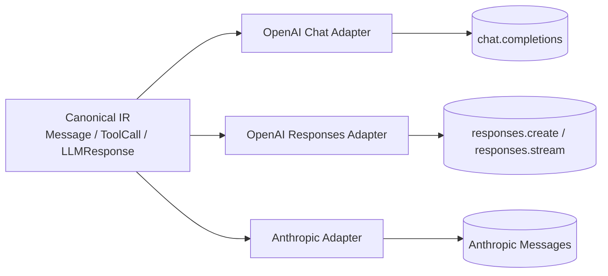

# OpenAI Responses API 执行级改造文档

**适用范围**: `AgentDev` 核心框架 + `AgentDevClaw` 预设/配置层  
**目标**: 在保留 `Chat Completions` 作为默认 OpenAI 实现的前提下，新增 `Responses API` 支持，并保持框架内部协议不变  
**状态**: 可执行方案稿  
**日期**: 2026-06-17

## 1. 结论

本次改造的正确方向不是把整个框架切到 Responses 原生格式，而是：

1. 保留现有 `Message / ToolCall / LLMResponse` 作为统一中间层。
2. OpenAI 的 `Chat Completions` 和 `Responses` 都只做适配器。
3. `provider` 只表示厂商，新增 `apiSurface` 表示 OpenAI 具体接口形态。
4. 一期默认继续使用 stateless 历史回放，不引入 `previous_response_id` 作为主状态链。
5. Claw 侧只负责把 `apiSurface` 从 UI -> preset -> resolver -> LLM 工厂完整透传。

这条线最稳，也最符合你们现在“Chat 作为底座，其它格式都写适配器”的原则。

## 2. 现状与依据

### 2.1 AgentDev 侧现状

- 核心消息和 LLM 响应类型已经定型：[`src/core/types.ts`](D:/code/AgentDev/src/core/types.ts:209)
- 现有 OpenAI 实现只走 Chat Completions：[`src/llm/openai.ts`](D:/code/AgentDev/src/llm/openai.ts:76)
- Anthropic 已经是典型“编译上下文 -> provider 请求”的适配器：[`src/llm/anthropic.ts`](D:/code/AgentDev/src/llm/anthropic.ts:152) / [`src/llm/anthropic.ts`](D:/code/AgentDev/src/llm/anthropic.ts:289)
- LLM 工厂目前仅按 `provider` 分发：[`src/llm/index.ts`](D:/code/AgentDev/src/llm/index.ts:13)

### 2.2 Claw 侧现状

- preset 读取和解析在：[`server/model-preset-resolver.js`](D:/code/AgentDevClaw/server/model-preset-resolver.js:21)
- preset 结构扁平化在：[`server.js`](D:/code/AgentDevClaw/server.js:6927)
- UI 编辑入口在：[`public/src/app-ui.js`](D:/code/AgentDevClaw/public/src/app-ui.js:3411)
- 当前 preset 只有 `protocol`，没有 `apiSurface`

### 2.3 SDK 能力现状

- 当前安装的 `openai` SDK 已经暴露 `responses` 资源：[`node_modules/openai/index.d.ts`](D:/code/AgentDev/node_modules/openai/index.d.ts:132)
- Responses 流式事件类型也已经存在：[`node_modules/openai/lib/responses/ResponseStream.d.ts`](D:/code/AgentDev/node_modules/openai/lib/responses/ResponseStream.d.ts:35)
- 官方 Responses 参考：
  - [Create a model response](https://developers.openai.com/api/reference/resources/responses/methods/create/)
  - [Responses streaming events](https://developers.openai.com/api/reference/resources/responses/streaming-events/)

## 3. 改造原则

1. 不改框架内部主协议。
2. 不把 Responses 原生结构扩散到所有调用点。
3. 不把 `provider` 和 `apiSurface` 混成一个字段。
4. 不在一期强行启用 `previous_response_id`。
5. 不把功能级 OpenAI 调用点一起迁移进主线。
6. 不新增无必要的抽象层；只在有重复编解码逻辑时才抽。
7. 所有新字段都必须默认兼容旧配置。

## 4. 目标架构



### 4.1 内部协议边界

框架内部只认：

- `Message`
- `ToolCall`
- `LLMResponse`
- `UsageInfo`
- `ThinkingBlock`

外部 provider 的差异全部藏在适配器里。

### 4.2 OpenAI surface 分层

OpenAI 只分两种 surface：

- `chat`
- `responses`

默认值必须是 `chat`，这样现有行为零回归。

## 5. 详细改造清单

### 5.1 AgentDev 核心

#### 5.1.1 `src/core/config.ts`

文件：[`src/core/config.ts`](D:/code/AgentDev/src/core/config.ts:18)

修改点：

- 在 `ModelConfig` 中新增：
  - `apiSurface?: 'chat' | 'responses'`
- 约定：
  - 未配置时默认视为 `chat`
  - 老配置不需要补字段

推荐定义：

```ts
export interface ModelConfig {
  provider: 'openai' | 'anthropic' | string;
  apiKey: string;
  model: string;
  baseUrl?: string;
  maxTokens?: number;
  thinkingBudgetTokens?: number;
  thinkingKeepTurns?: number;
  providerOptions?: Record<string, unknown>;
  customHeaders?: CustomHeaderEntry[];
  apiSurface?: 'chat' | 'responses';
}
```

#### 5.1.2 `src/llm/index.ts`

文件：[`src/llm/index.ts`](D:/code/AgentDev/src/llm/index.ts:13)

修改点：

- 保留 `createLLM()` 的现有重载。
- 在 `provider=openai` 时再按 `apiSurface` 分发：
  - `responses` -> 新适配器
  - 其他值或未配置 -> 现有 Chat 适配器
- `anthropic` 路径不变。

实现要求：

- 不改变对外签名。
- 不改变默认分支。
- 不把 `apiSurface` 传错到 Anthropic。

#### 5.1.3 `src/llm/openai.ts`

文件：[`src/llm/openai.ts`](D:/code/AgentDev/src/llm/openai.ts:76)

处理策略：

- 作为 Chat Completions 专用适配器继续保留。
- 不要把 Responses 逻辑塞进这个文件。
- 不要把 stream 事件解析分支做成大杂烩。

原因：

- 这个文件已经清晰承担了 `chat.completions` 的流式聚合职责。
- 一旦混入 Responses，会导致两个不同事件模型搅在一起。

#### 5.1.4 新增 `src/llm/openai-responses.ts`

新增文件：`src/llm/openai-responses.ts`

职责：

- 将统一中间层 `Message[] / Tool[]` 编译为 Responses 输入。
- 调用 `client.responses.create(...)` 或 `client.responses.stream(...)`。
- 把 Responses 输出重新聚合为 `LLMResponse`。
- 保持与现有 `ReActLoopRunner` 兼容。

建议暴露：

```ts
export class OpenAIResponsesLLM implements LLMClient {
  async chat(messages: Message[], tools: Tool[], options?: { signal?: AbortSignal }): Promise<LLMResponse>;
}
```

建议额外提供：

```ts
export function createOpenAIResponsesLLM(...): OpenAIResponsesLLM;
```

#### 5.1.5 `src/test/openai-responses.test.ts`

新增测试覆盖：

- 单轮文本输出
- 单个工具调用
- 多工具调用
- tool result 回传后继续下一轮
- reasoning 映射
- usage 映射
- stopReason 映射
- abort 行为
- retry 行为

### 5.2 Claw 预设与 UI

#### 5.2.1 `config/presets.json`

文件：[`config/presets.json`](D:/code/AgentDevClaw/config/presets.json)

修改点：

- 每个 preset 增加可选字段：
  - `apiSurface: "chat" | "responses"`
- 兼容规则：
  - 缺省时默认 `chat`
  - 旧配置无需重写

示例：

```json
{
  "name": "GPT5.5",
  "providerName": "GPT5.5",
  "protocol": "openai",
  "apiSurface": "responses",
  "model": "gpt-5.5",
  "thinkingBudgetTokens": 200000,
  "maxTokens": 400000
}
```

#### 5.2.2 `server/model-preset-resolver.js`

文件：[`server/model-preset-resolver.js`](D:/code/AgentDevClaw/server/model-preset-resolver.js:21)

修改点：

- 读取 `preset.apiSurface`
- 透传到 `createLLM(...)`
- 不要把 `apiSurface` 写回到 `provider`

建议行为：

- `protocol=openai` 且 `apiSurface=responses` -> `provider=openai` + `apiSurface=responses`
- 其他情况默认 `apiSurface=chat`

#### 5.2.3 `server.js`

文件：[`server.js`](D:/code/AgentDevClaw/server.js:6927)

修改点：

- `flattenModelPresets(...)` 保留 `apiSurface`
- `buildStructuredModelPresets(...)` 序列化时保留 `apiSurface`
- preset 保存/编辑/回显路径都必须 round-trip

必须保证：

- 旧 JSON 没这个字段时不会报错
- UI 保存后不会丢字段
- 读写前后 `protocol` 和 `apiSurface` 彼此独立

#### 5.2.4 `public/src/app-ui.js`

文件：[`public/src/app-ui.js`](D:/code/AgentDevClaw/public/src/app-ui.js:3411)

修改点：

- 在 preset 编辑器里增加 `Chat / Responses` 选项
- 新字段默认值为 `chat`
- 保存按钮和渲染回显都要接上

交互要求：

- 不改变现有 preset 编辑流程
- 不增加二级弹窗
- 默认值可见但不干扰老用户

## 6. Responses 适配器设计细节

### 6.1 输入编译

建议在适配器内部做一个显式编译函数：

```ts
function compileContextForOpenAIResponses(messages: Message[], tools: Tool[]) {
  return {
    input: ...,
    tools: ...,
    instructions: ...,
  };
}
```

编译规则：

1. `system` / `user` 消息编译为 Responses 支持的输入 message item。
2. `assistant` 历史消息保留可见文本、tool call 关联信息、reasoning 片段。
3. `tool` 消息编译为 `function_call_output`，并且必须带原始 `call_id`。
4. 如果历史里已经有 reasoning summary，可作为 reasoning item replay。
5. 不要把历史转成纯字符串拼接后再喂给模型，能保留 typed item 就保留。

### 6.2 输出解析

Responses 输出到框架内部的映射：

| Responses item / field | 框架内部 |
|---|---|
| `output_text` | `LLMResponse.content` |
| `ResponseFunctionToolCall` | `LLMResponse.toolCalls[]` |
| `ResponseReasoningItem.summary` | `LLMResponse.reasoning` 或 `thinkingBlocks` |
| `usage` | `LLMResponse.usage` |
| `status / incomplete_details` | `LLMResponse.stopReason` |

细节要求：

- `output_text` 为空但有 tool calls 时，仍然算有效响应。
- `output_text` 为空、tool calls 为空时，交给现有 empty-response 逻辑处理。
- reasoning 只记录 API 明确返回的 summary / reasoning 文本，不额外暴露隐藏链路内容。

### 6.3 流式事件处理

SDK 已暴露的关键事件：

- `response.output_text.delta`
- `response.function_call_arguments.delta`
- `response.output_item.added`
- `response.output_item.done`
- `response.completed`
- `response.failed`
- `response.incomplete`

处理原则：

1. 文本增量直接 append 到 `content`。
2. function call 参数增量按 `call_id` 累积。
3. reasoning summary 单独累积。
4. 最终响应以 `response.completed` 作为收口点。
5. 失败和不完整状态要进入统一错误分类。

### 6.4 tool call 状态机

必须保证：

- 一个 `call_id` 对应一个 `ToolCall`
- tool result 回传时使用同一个 `call_id`
- 多个 tool call 的顺序必须保持
- `exclusive` 工具语义仍然由现有 `ReActLoopRunner` 控制，不要让 provider 自己替代

建议逻辑：

1. Response 里出现 `function_call`。
2. 解析出 `call_id`、工具名、JSON 参数。
3. 返回给核心循环为 `toolCalls[]`。
4. 核心循环照旧执行工具。
5. 工具结果回写为框架 `tool` 消息。
6. 下一轮编译器把 `tool` 消息转回 `function_call_output`。

### 6.5 token / usage 映射

OpenAI Responses 的输出 token 字段与现有 `UsageInfo` 的映射要统一：

- `inputTokens` -> prompt / input usage
- `outputTokens` -> visible output + reasoning output
- `totalTokens` -> 二者求和

如果 SDK 返回更细的 reasoning token breakdown，再补到：

- `reasoningTokens`

### 6.6 超时、abort、重试

沿用现有错误策略，不新增“静默失败”路径：

- `AbortSignal` 优先终止
- 网络错误 / 5xx / rate limit 继续重试
- 400 / schema 错误 / 参数错误不重试
- 最终错误仍通过 `classifyAndWrapError(...)` 统一包装

### 6.7 `previous_response_id` 策略

一期默认不用它。

原因：

- 你们现有的 session restore、checkpoint、rollback 都是基于显式历史状态。
- stateless replay 更容易调试和回放。
- Responses 的状态链模式更适合未来做“省上下文”的优化，不适合作为第一版主路径。

后续如果要做：

- 需要单独增加 session state 模式
- 要定义“何时保存 response.id”
- 要定义“何时用 previous_response_id 替代全量 replay”

## 7. 规范

### 7.1 代码规范

1. 适配器只负责 provider 协议转换，不做业务编排。
2. 编译器只做消息/工具映射，不做重试。
3. 核心循环不认识任何 provider 原生事件。
4. 不写一堆 if/else 把 chat 和 responses 混到一个函数里。
5. 新增类型/字段必须有默认兼容逻辑。

### 7.2 配置规范

1. `protocol` 仍表示厂商协议栈大类。
2. `apiSurface` 只对 OpenAI 有意义。
3. 缺省值必须是 `chat`。
4. preset 的 JSON 结构要可 round-trip。
5. UI、存储、resolver 三处字段名必须完全一致。

### 7.3 日志规范

1. 不记录 API key。
2. 不记录完整自定义请求头。
3. 不在普通日志中输出未经裁剪的 reasoning 内容。
4. tool 参数和 tool 结果若含敏感信息，日志中只保留摘要。

### 7.4 测试规范

1. 单测优先覆盖编译/解析函数。
2. 集成测试覆盖完整 agent loop。
3. 兼容性测试必须验证旧配置不受影响。
4. 任何新增开关都要有默认值测试。

## 8. 执行顺序

### Phase 0: 只加配置，不改行为

- `ModelConfig` 增加 `apiSurface`
- `presets.json` 增加字段但默认 `chat`
- UI 先只加默认值透传，暂不切换逻辑

### Phase 1: 新增 OpenAI Responses 适配器

- 新增 `src/llm/openai-responses.ts`
- 在 `src/llm/index.ts` 加分发
- 新增单测

### Phase 2: Claw preset 端到端透传

- `server/model-preset-resolver.js`
- `server.js`
- `public/src/app-ui.js`

### Phase 3: 小范围联调

- 选一个 OpenAI Responses preset
- 只跑一个 agent
- 验证 tool call、reasoning、usage、stopReason

### Phase 4: 视需要迁移功能级调用点

下面这些不是主线，但以后可统一：

- [`packages/audit-feature/src/index.ts`](D:/code/AgentDev/packages/audit-feature/src/index.ts:288)
- [`src/features/visual/tools.ts`](D:/code/AgentDev/src/features/visual/tools.ts:295)

## 9. 测试矩阵

### 9.1 AgentDev 单测

| 测试项 | 预期 |
|---|---|
| 单轮文本输出 | `content` 正常，`toolCalls` 为空 |
| 单工具调用 | `toolCalls.length === 1`，参数正确 |
| 多工具调用 | 顺序保持，调用都能解析 |
| 工具结果回传 | 下一轮能正确继续 |
| reasoning | 能映射到 `reasoning` / `thinkingBlocks` |
| usage | 能映射到 `UsageInfo` |
| stopReason | 能正确驱动空响应逻辑 |
| abort | 立刻退出且不污染上下文 |
| retry | 临时错误可重试，参数错误不重试 |

### 9.2 Claw 配置测试

| 测试项 | 预期 |
|---|---|
| 旧 preset 无 `apiSurface` | 默认 `chat` |
| 选择 `responses` 后保存 | JSON 保留字段 |
| 重新打开 UI | 字段回显正确 |
| resolver 读取 | `createLLM()` 收到正确 surface |

### 9.3 手工联调检查

1. 选一个 `protocol=openai` 的 preset，切到 `responses`。
2. 启动一次完整 agent 交互。
3. 检查：
   - 文本是否正常输出
   - tool call 是否正确触发
   - tool result 是否回写下一轮
   - reasoning / usage 是否在调试视图中可见
4. 将 `apiSurface` 改回 `chat`，验证可以无缝回退。

## 10. 回滚策略

如果 Responses 路径出现问题，回滚非常简单：

1. 把对应 preset 的 `apiSurface` 改回 `chat`。
2. 保留新适配器代码，不删除。
3. 继续用现有 Chat Completions 路径跑生产流量。

因为这次改造是并行 surface，不是硬替换，所以回滚成本很低。

## 11. 验收标准

必须全部满足：

1. 旧 OpenAI Chat 路径零回归。
2. `apiSurface=responses` 的 OpenAI preset 能跑完整 agent loop。
3. 工具调用和工具结果映射正确。
4. reasoning、usage、stopReason 都能被现有框架消费。
5. Claw 的 preset 读写不丢字段。
6. 默认行为仍然是 `chat`。
7. 不需要改老配置就能继续运行。

## 12. 参考阅读

### 12.1 官方文档

- [OpenAI Responses API Create](https://developers.openai.com/api/reference/resources/responses/methods/create/)
- [OpenAI Responses streaming events](https://developers.openai.com/api/reference/resources/responses/streaming-events/)
- [OpenAI Function Calling Guide](https://platform.openai.com/docs/guides/function-calling)
- [OpenAI Conversation State Guide](https://platform.openai.com/docs/guides/conversation-state)

### 12.2 本仓库关键文件

- [`src/core/types.ts`](D:/code/AgentDev/src/core/types.ts:209)
- [`src/llm/openai.ts`](D:/code/AgentDev/src/llm/openai.ts:76)
- [`src/llm/anthropic.ts`](D:/code/AgentDev/src/llm/anthropic.ts:152)
- [`src/llm/index.ts`](D:/code/AgentDev/src/llm/index.ts:13)
- [`server/model-preset-resolver.js`](D:/code/AgentDevClaw/server/model-preset-resolver.js:21)
- [`server.js`](D:/code/AgentDevClaw/server.js:6927)
- [`public/src/app-ui.js`](D:/code/AgentDevClaw/public/src/app-ui.js:3411)

### 12.3 SDK 类型参考

- [`node_modules/openai/index.d.ts`](D:/code/AgentDev/node_modules/openai/index.d.ts:132)
- [`node_modules/openai/lib/responses/ResponseStream.d.ts`](D:/code/AgentDev/node_modules/openai/lib/responses/ResponseStream.d.ts:35)
- [`node_modules/openai/resources/responses/responses.d.ts`](D:/code/AgentDev/node_modules/openai/resources/responses/responses.d.ts:1526)

## 13. 不要做的事情

1. 不要把 Responses 原始 output 直接存进 `Context`。
2. 不要把 `provider` 扩成 `openai-chat` / `openai-responses` 这种混合命名。
3. 不要把 `previous_response_id` 当成默认状态恢复方案。
4. 不要把流式处理硬写成“如果有 delta.content 就 append”。
5. 不要把功能级 OpenAI 调用点和主 agent loop 一起重构。
6. 不要在没有单测的情况下改适配器核心逻辑。

## 14. 建议的提交拆分

如果要按 commit 拆，建议：

1. `feat(core): add apiSurface to model config`
2. `feat(llm): add openai responses adapter`
3. `test(llm): cover responses adapter`
4. `feat(claw): persist apiSurface in presets`
5. `feat(claw-ui): expose apiSurface selector`

这样每一步都能独立回滚。

