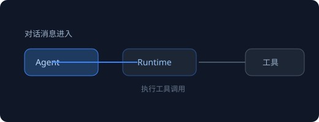

# AgentDevClaw 使用指南

这里是 AgentDevClaw 的用户手册。左侧是目录树，右侧是当前文档正文；目录按文件夹组织，点击即读。

## 快速导航

- 想直接上手 → [基础概念](./01-基础概念.md) → [快速上手](./02-快速上手.md)
- 想深入某个专题 → [进阶用法](./进阶用法/03-会话与上下文.md)

## 这份指南怎么维护

指南内容就是本仓库 `guide/` 文件夹里的 markdown 文件：

- 新建一个 `.md` 文件或文件夹，指南目录自动出现对应条目（数字前缀决定排序）。
- 图片放在文档旁边的文件夹里（如 `assets/`），用相对路径引用即可渲染。
- 指南工作空间会随文件改动自动刷新目录。

## 图片写法示例

固定宽度并居中：

按比例缩放（占正文宽度 60%）：

也兼容 Typora 粘贴产生的原生 HTML 写法（zoom / width 均可解析）：

下一页：[基础概念](./01-基础概念.md)
