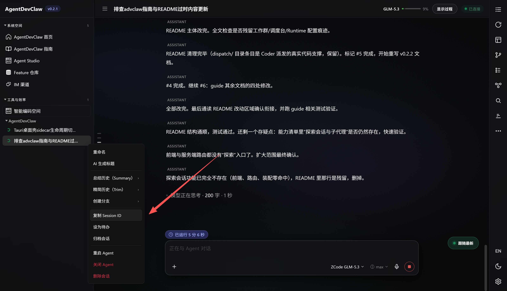
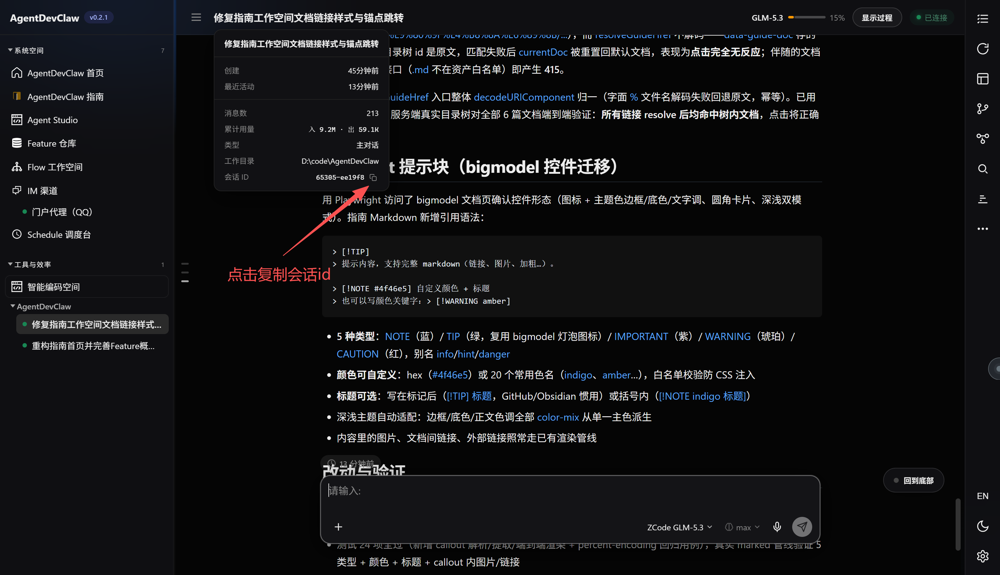

# 跨对话记忆（Beta）

编程小助手可以读取历史会话的内容，把之前对话中的上下文带进当前任务。有两种方式指定要读取的历史会话。

## 会话引用（推荐）

在输入框中把一条历史会话作为引用挂上：

- 点击输入框的「+」按钮，选择「会话」，在弹窗中挑选目标会话；
- 或者直接把左侧列表中的会话**拖拽**到输入框。

引用以胶囊形式挂在输入框上，随下一条消息一起发出。这是一种结构化的投递：Agent 收到的是明确的引用信息，而非混在正文里的一段文字。它先用工具查看该会话的概览，再按需深入具体轮次——与当前任务无关的部分不会占用上下文窗口。引用随消息发出即消费，发送失败会自动归还到输入框。

## 复制会话 ID

把 ID 告诉 Agent（例如「读一下这个会话的内容：<ID>」），Agent 会定位并读取对应的历史会话。复制 ID 有两个入口：

- **左侧会话列表**：右键会话条目（或点「⋯」菜单），选择「复制 Session ID」；
- **对话页顶部**：鼠标靠近会话标题区域，从展开的会话信息中复制。

 

> [!NOTE] 此功能尚在迭代中
> 对上下文特别长的历史会话，引用后的信息检索可能不够充分，部分内容不一定能被读取到。我们正在持续提升检索质量，并降低上下文成本。
